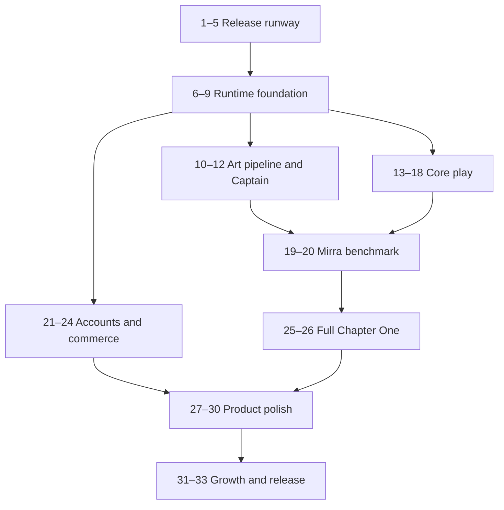

# Just Some Stars Implementation Plan

> **For agentic workers:** REQUIRED SUB-SKILL: Use superpowers:subagent-driven-development (recommended) or superpowers:executing-plans to implement this plan task-by-task. Steps use checkbox (`- [ ]`) syntax for tracking.

**Goal:** Build, verify and publicly release the complete Android Chapter One of *Just Some Stars* with its approved visual quality, family experience, optional cloud account, birthday gifts and RevenueCat-powered cosmetics.

**Architecture:** A Unity 6 URP project uses isolated feature assemblies, data-driven content and explicit runtime modes. All external capabilities sit behind C# service interfaces; Google Play and Galaxy Store receive separate builds while sharing gameplay, content and cloud identity. Blender source assets, Unity CLI automation and CI produce deterministic Android artifacts from the same repository.

**Tech Stack:** Unity 6 LTS, C#, URP, Input System, Cinemachine, Addressables, AI Navigation, uGUI, TextMeshPro, UI Toolkit, Shader Graph/HLSL, Blender/Python/Blender MCP, Firebase Authentication/Firestore/Cloud Functions, RevenueCat, Kotlin/Java, Gradle, Codemagic and Android SDK tools.

**Spec:** `outputs/just-some-stars-technical-build-plan.md`

## Global Constraints

- Use `/mnt/unity-data/JustSomeStars` as the canonical Git worktree and project root. Keep every game file there, including the Unity project, `Library`, imported/generated assets, build outputs and caches; do not create a second active worktree on the system partition.
- The image at `outputs/just-some-stars-mirra-gameplay-target-v1.png` is the binding visual quality floor. Hackathon speed, mobile constraints and temporary prototypes never justify silently lowering that final bar.
- Code must remain production-grade and modular: small focused assemblies and components, explicit interfaces, data-driven content, dependency injection at composition roots, automated tests where practical, and no giant manager classes or hidden cross-system coupling.
- Execute strictly one numbered task at a time. Finish its checklist, run fresh verification, report the evidence and pause for approval before beginning the next task.
- Chapter One is a complete, free 45–60 minute story ending before dinner.
- Primary runtime is Android; Google Play and Galaxy Store builds are separate and Steam remains future work.
- Package IDs are `com.scientificaj.justsomestars` and `com.scientificaj.justsomestars.galaxy`.
- The Realme Narzo Performance profile must sustain a stable 30 FPS in representative play and thermal testing.
- Three Captain body families share gameplay capability and receive fitted clothing, collider, camera, IK and stride calibration.
- Only two crew companions plus Ori run full destination intelligence.
- Gameplay, learning, accessibility and story completion never require a purchase, login or network connection.
- No advertisements, subscriptions, premium currency, randomized loot, energy, public chat or paid power ship in Chapter One.
- Exact birthday is private, supports annual gifts and is excluded from advertising analytics.
- No hero character enters Blender production before its approved reference sheet.
- Unity CLI and Blender MCP are required production interfaces, not optional documentation examples.
- External SDK failures must degrade to local/offline play without blocking Chapter One.
- Every implementation task follows red-green-refactor where automated tests are practical and ends at a reviewer/commit gate.
- Never commit signing keys, passwords, store credentials, Firebase admin credentials or private API keys.

---

## Delivery map

| Work package | Tasks | Exit condition |
|---|---:|---|
| Release runway | 1–5 | Installable skeleton build is in Google closed testing and CI can reproduce it |
| Runtime foundation | 6–9 | Modes, input, saves, services and scene streaming work offline |
| Art pipeline and Captain | 10–12 | Approved references produce validated modular characters in Unity |
| Core play | 13–18 | Surface, crew, Lens, flight and missions form one playable loop |
| Mirra benchmark | 19–20 | Mirra reaches mechanics-complete and visual-quality acceptance |
| Accounts and commerce | 21–24 | Google cloud, birthdays, RevenueCat and Galaxy adapters are verified |
| Full Chapter One | 25–26 | Koro/Vesper, Aster Veil, opening and ending complete the story |
| Product polish | 27–30 | Cosmetics, UI/accessibility, audio/cinematics and performance are release-ready |
| Growth and release | 31–33 | Services are truthfully activated, both store candidates verified and one public release is live |

## Dependency order



## Planned repository structure

```text
just-some-stars/
├── Assets/
│   ├── _JustSomeStars/
│   │   ├── Art/{Characters,Ori,Ship,Environments,Materials,VFX,UI}/
│   │   ├── Audio/{Music,SFX,Voice}/
│   │   ├── Content/{Missions,Dialogue,Atlas,Cosmetics,Phenomena}/
│   │   ├── Prefabs/{Characters,Crew,Ship,Gameplay,UI}/
│   │   ├── Scenes/{Core,Destinations,Cinematics}/
│   │   ├── Runtime/
│   │   │   ├── Core/
│   │   │   ├── Input/
│   │   │   ├── Saving/
│   │   │   ├── Player/
│   │   │   ├── Crew/
│   │   │   ├── Flight/
│   │   │   ├── Interaction/
│   │   │   ├── Discovery/
│   │   │   ├── Missions/
│   │   │   ├── Dialogue/
│   │   │   ├── Atlas/
│   │   │   ├── Cosmetics/
│   │   │   ├── Accounts/
│   │   │   ├── Commerce/
│   │   │   ├── Accessibility/
│   │   │   ├── UI/
│   │   │   └── Platform/
│   │   ├── Editor/{Build,Validation,Importers}/
│   │   └── Tests/{EditMode,PlayMode}/
│   └── Plugins/Android/
├── Packages/
├── ProjectSettings/
├── firebase/functions/
├── tools/blender/
├── docs/
├── outputs/
└── codemagic.yaml
```

## Locked cross-system interfaces

The following signatures are fixed before feature work begins. Supporting result records and enums live beside their owning interface so later tasks do not create competing service shapes.

```csharp
public interface IGameService
{
    ValueTask<StartupResult> InitializeAsync(CancellationToken cancellationToken);
    ValueTask ShutdownAsync();
}

public interface ISaveService : IGameService
{
    ValueTask<LoadSaveResult> LoadAsync(CancellationToken cancellationToken);
    ValueTask SaveCheckpointAsync(GameSave save, CancellationToken cancellationToken);
    ValueTask<LoadSaveResult> RecoverAsync(CancellationToken cancellationToken);
    GameSave Merge(GameSave local, GameSave cloud);
}

public interface IAccountService : IGameService
{
    AccountState Current { get; }
    ValueTask<AccountLinkResult> LinkGoogleAsync(CancellationToken cancellationToken);
    ValueTask SignOutAsync(CancellationToken cancellationToken);
    ValueTask DeleteAccountAsync(CancellationToken cancellationToken);
}

public interface ICloudSaveService : IGameService
{
    ValueTask<CloudSaveSnapshot?> DownloadAsync(string userId, CancellationToken cancellationToken);
    ValueTask UploadAsync(string userId, GameSave save, CancellationToken cancellationToken);
    ValueTask DeleteAsync(string userId, CancellationToken cancellationToken);
}

public interface IStoreService : IGameService
{
    StoreAvailability Availability { get; }
    ValueTask<IReadOnlyList<StoreProduct>> GetProductsAsync(CancellationToken cancellationToken);
    ValueTask<PurchaseResult> PurchaseAsync(ContentId productId, CancellationToken cancellationToken);
    ValueTask<EntitlementSnapshot> RestoreAsync(CancellationToken cancellationToken);
    ValueTask<EntitlementSnapshot> RefreshEntitlementsAsync(CancellationToken cancellationToken);
}
```

`ContentId` is the only identifier passed between content systems. Gameplay listens to typed records such as `LandingCompleted`, `PhenomenonObserved`, `PredictionRecorded`, `InstrumentUsed`, `SignalFragmentRecovered` and `ConversationCompleted`; it never branches on ad-hoc string event names.

---

### Task 0: Prepare the development environment and agent services

**Status:** Executed on 2026-08-21. Pause after this task; Task 1 requires a separate user approval.

**Agent handoff:** The live, detailed source of truth is `/mnt/unity-data/JustSomeStars/docs/tooling/agent-environment.md`. The repository also has a root `AGENTS.md`; read both before installing tools or using ShipKit credits.

- [x] Clone the public greenfield repository, move its canonical work directory to `/mnt/unity-data/JustSomeStars`, and create branch `setup/task-0-environment`.
- [x] Verify Unity `6000.3.22f1`, Blender `5.2.0 LTS`, Git `2.53.0`, Android SDK/ADB, Node.js and pnpm.
- [x] Install Git LFS `3.7.1` locally, expose it on the user PATH and initialize it for the checkout.
- [x] Verify Blender MCP on `localhost:9876`, with Poly Haven enabled and telemetry disabled.
- [x] Authenticate Limrun CLI `0.28.6`, verify its API connection and 2,000 non-expiring credits, and install its official project-scoped Codex skills.
- [x] Install Argent CLI `0.21.0`, verify its 74 tools, declare its project MCP server and install its official agent skills.
- [x] Record every ShipKit/platform status and the correct future activation point in the agent environment manifest.
- [x] Install and verify Unity's bundled Android SDK tools 16.0, ADB 36.0.0, NDK r27c and OpenJDK 17.0.18.
- [x] Select Limrun cloud Android as the primary runtime instead of requiring the
  physical Realme Narzo; use Argent as the interaction/QA layer and create an
  emulator only for an immediate APK test.
- [x] Verify GitHub CLI authentication for `ScientificAJ` through a live `gh api user` request.
- [ ] Reopen the workspace before using the newly installed project-scoped Argent MCP.

Task 0 creates tooling/configuration only. It does not create the Unity project or begin gameplay implementation.

---

### Task 1: Clone the greenfield repository and preserve the approved documents

**Files:**
- Create in repository: `outputs/astronomy-adventure-game-blueprint.md`
- Create in repository: `outputs/just-some-stars-technical-build-plan.md`
- Create in repository: `outputs/just-some-stars-mirra-gameplay-target-v1.png`
- Create in repository: `docs/superpowers/plans/2026-08-21-just-some-stars-implementation.md`
- Modify: `.gitattributes`
- Modify: `.gitignore`
- Modify: `README.md`

**Interfaces:**
- Consumes: approved design and visual artifacts from the planning workspace.
- Produces: one real Git working tree whose documentation and image paths match this plan.

- [ ] **Step 1: Clone and enter the repository**

```bash
git clone https://github.com/ScientificAJ/just-some-stars.git
cd just-some-stars
```

Expected: `git remote -v` identifies `ScientificAJ/just-some-stars` and `git status --short` is empty.

- [ ] **Step 2: Copy the four approved planning artifacts into their exact repository paths**

```bash
mkdir -p outputs docs/superpowers/plans
cp /home/john/Documents/Codex/2026-08-20/y/outputs/astronomy-adventure-game-blueprint.md outputs/
cp /home/john/Documents/Codex/2026-08-20/y/outputs/just-some-stars-technical-build-plan.md outputs/
cp /home/john/Documents/Codex/2026-08-20/y/outputs/just-some-stars-mirra-gameplay-target-v1.png outputs/
cp /home/john/Documents/Codex/2026-08-20/y/docs/superpowers/plans/2026-08-21-just-some-stars-implementation.md docs/superpowers/plans/
```

Then verify:

```bash
test -f outputs/astronomy-adventure-game-blueprint.md
test -f outputs/just-some-stars-technical-build-plan.md
test -f outputs/just-some-stars-mirra-gameplay-target-v1.png
test -f docs/superpowers/plans/2026-08-21-just-some-stars-implementation.md
```

Expected: all four commands exit `0`.

- [ ] **Step 3: Add Unity-friendly Git attributes and ignore rules**

Enable Git LFS and track source/binary art before adding those files:

```bash
git lfs install
git lfs track "*.blend" "*.fbx" "*.png" "*.psd" "*.wav" "*.mp4"
```

`.gitattributes` must also normalize ordinary text files to LF. `.gitignore` must exclude `Library/`, `Temp/`, `Logs/`, `Obj/`, `Builds/`, user settings and local secrets while retaining `ProjectSettings/`, `Packages/` and source art intended for version control.

- [ ] **Step 4: Update README with title, one-sentence pitch, visual target, Android stores and document links**

Expected: a new contributor reaches the blueprint, technical build plan and implementation plan directly from `README.md`.

- [ ] **Step 5: Review and commit the documentation baseline**

```bash
git diff --check
git status --short
git add .gitattributes .gitignore README.md outputs docs/superpowers/plans
git commit -m "docs: add approved Just Some Stars production plan"
```

### Task 2: Create the Unity 6 URP project and lock packages

**Files:**
- Create: `ProjectSettings/ProjectVersion.txt`
- Create: `ProjectSettings/ProjectSettings.asset`
- Create: `Packages/manifest.json`
- Create: `Packages/packages-lock.json`
- Create: `Assets/_JustSomeStars/Runtime/JustSomeStars.Runtime.asmdef`
- Create: `Assets/_JustSomeStars/Editor/JustSomeStars.Editor.asmdef`
- Create: `Assets/_JustSomeStars/Tests/EditMode/JustSomeStars.EditModeTests.asmdef`
- Create: `Assets/_JustSomeStars/Tests/PlayMode/JustSomeStars.PlayModeTests.asmdef`

**Interfaces:**
- Consumes: Unity 6 LTS editor selected for production.
- Produces: compilable URP project with isolated runtime, editor and test assemblies.

- [ ] **Step 1: Create the project through Unity CLI**

```bash
export JSS_PROJECT_PATH="$PWD"
test -n "$JSS_UNITY_EDITOR"
test -x "$JSS_UNITY_EDITOR"
"$JSS_UNITY_EDITOR" -batchmode -quit -createProject "$JSS_PROJECT_PATH"
```

Expected: the shell already provides `JSS_UNITY_EDITOR` as the installed Unity 6 LTS editor binary, both `test` commands succeed, and `ProjectSettings/ProjectVersion.txt` records that editor revision.

- [ ] **Step 2: Install and resolve the required Unity packages**

`Packages/manifest.json` must include URP, Input System, Addressables, Cinemachine, AI Navigation, Localization and Test Framework packages resolved for the selected editor. Let Unity write `packages-lock.json`; do not hand-invent dependency hashes.

- [ ] **Step 3: Create focused assembly definitions**

Runtime must not reference Editor or test assemblies. Editor references Runtime. EditMode tests reference Runtime and Editor; PlayMode tests reference Runtime.

- [ ] **Step 4: Add a compilation smoke test**

Create `Assets/_JustSomeStars/Tests/EditMode/ProjectCompilationTests.cs`:

```csharp
using NUnit.Framework;

namespace JustSomeStars.Tests.EditMode;

public sealed class ProjectCompilationTests
{
    [Test]
    public void ProjectAssembly_IsLoadable() =>
        Assert.That(typeof(JustSomeStars.Runtime.ProjectMarker), Is.Not.Null);
}
```

Create `Assets/_JustSomeStars/Runtime/ProjectMarker.cs` with an empty sealed `ProjectMarker` class in `JustSomeStars.Runtime`.

- [ ] **Step 5: Run the EditMode suite**

```bash
"$JSS_UNITY_EDITOR" -batchmode -nographics -quit -projectPath "$PWD" \
  -runTests -testPlatform editmode -testResults Builds/TestResults/editmode.xml
```

Expected: exit `0` and one passing test.

- [ ] **Step 6: Commit the compilable Unity baseline**

```bash
git add Assets Packages ProjectSettings
git commit -m "build: create Unity 6 URP project"
```

### Task 3: Implement deterministic Unity CLI builds

**Files:**
- Create: `Assets/_JustSomeStars/Editor/Build/BuildTargetKind.cs`
- Create: `Assets/_JustSomeStars/Editor/Build/BuildCli.cs`
- Create: `Assets/_JustSomeStars/Editor/Build/BuildConfiguration.cs`
- Create: `Assets/_JustSomeStars/Tests/EditMode/BuildConfigurationTests.cs`
- Create: `ProjectSettings/AndroidResolverDependencies.xml` only when generated by installed Android SDK resolvers

**Interfaces:**
- Produces: `BuildCli.BuildAndroidInternal()`, `BuildCli.BuildGooglePlayRelease()` and `BuildCli.BuildGalaxyRelease()`.
- Produces: scripting symbols `JSS_DEVELOPMENT`, `JSS_GOOGLE_PLAY` and `JSS_GALAXY` with mutual-exclusion validation.

- [ ] **Step 1: Write failing build-configuration tests**

```csharp
[TestCase(BuildTargetKind.GooglePlay, "com.scientificaj.justsomestars", "JSS_GOOGLE_PLAY")]
[TestCase(BuildTargetKind.Galaxy, "com.scientificaj.justsomestars.galaxy", "JSS_GALAXY")]
public void Resolve_ReturnsStoreSpecificIdentity(
    BuildTargetKind kind, string packageId, string requiredSymbol)
{
    var result = BuildConfiguration.Resolve(kind, buildNumber: 42);
    Assert.That(result.PackageId, Is.EqualTo(packageId));
    Assert.That(result.DefineSymbols, Does.Contain(requiredSymbol));
    Assert.That(result.VersionCode, Is.EqualTo(42));
}
```

- [ ] **Step 2: Run the targeted test and confirm failure**

```bash
"$JSS_UNITY_EDITOR" -batchmode -nographics -quit -projectPath "$PWD" \
  -runTests -testPlatform editmode \
  -testFilter JustSomeStars.Tests.EditMode.BuildConfigurationTests \
  -testResults Builds/TestResults/build-config-red.xml
```

Expected: failure because `BuildConfiguration` does not exist.

- [ ] **Step 3: Implement configuration and CLI entry points**

Each entry point must set package ID, symbols, version code, output name, development flags, Android target and keystore variables; build Addressables; call `BuildPipeline.BuildPlayer`; log the report; and throw on any non-success result so the process returns a failing exit code.

- [ ] **Step 4: Run tests and a Development APK build**

```bash
"$JSS_UNITY_EDITOR" -batchmode -nographics -quit -projectPath "$PWD" \
  -runTests -testPlatform editmode -testResults Builds/TestResults/build-config-green.xml
"$JSS_UNITY_EDITOR" -batchmode -nographics -quit -projectPath "$PWD" \
  -executeMethod JustSomeStars.Editor.Build.BuildCli.BuildAndroidInternal
```

Expected: tests pass and `Builds/AndroidInternal/JustSomeStars-internal.apk` exists.

- [ ] **Step 5: Commit**

```bash
git add Assets/_JustSomeStars/Editor Assets/_JustSomeStars/Tests ProjectSettings
git commit -m "build: add deterministic Android CLI targets"
```

### Task 4: Create the Boot scene and service registry

**Files:**
- Create: `Assets/_JustSomeStars/Runtime/Core/IGameService.cs`
- Create: `Assets/_JustSomeStars/Runtime/Core/ServiceRegistry.cs`
- Create: `Assets/_JustSomeStars/Runtime/Core/GameBootstrap.cs`
- Create: `Assets/_JustSomeStars/Runtime/Core/StartupReport.cs`
- Create: `Assets/_JustSomeStars/Scenes/Core/Boot.unity`
- Create: `Assets/_JustSomeStars/Tests/EditMode/ServiceRegistryTests.cs`
- Create: `Assets/_JustSomeStars/Tests/PlayMode/BootSceneTests.cs`

**Interfaces:**
- Produces: `IGameService.InitializeAsync(CancellationToken)` and `IGameService.ShutdownAsync()`.
- Produces: `ServiceRegistry.Register<T>()`, `Get<T>()` and `TryGet<T>()`.
- Produces: startup results that distinguish required local services from optional network services.

- [ ] **Step 1: Write registry tests for unique registration and missing services**

```csharp
[Test]
public void RegisteringSameContractTwice_Throws()
{
    var registry = new ServiceRegistry();
    registry.Register<ITestService>(new TestService());
    Assert.Throws<InvalidOperationException>(() =>
        registry.Register<ITestService>(new TestService()));
}
```

- [ ] **Step 2: Implement the registry and bootstrap contracts**

Required startup order: settings, local save, input, content catalogue and mode controller. Optional services—cloud, commerce, notifications, attribution and growth—initialize afterward and report unavailable without aborting startup.

- [ ] **Step 3: Build `Boot.unity` with one persistent `GameBootstrap` root**

The root survives scene changes, prevents duplicate bootstraps and routes successful startup to `Frontend`.

- [ ] **Step 4: Run EditMode and PlayMode tests**

```bash
"$JSS_UNITY_EDITOR" -batchmode -nographics -quit -projectPath "$PWD" \
  -runTests -testPlatform editmode -testResults Builds/TestResults/boot-edit.xml
"$JSS_UNITY_EDITOR" -batchmode -nographics -quit -projectPath "$PWD" \
  -runTests -testPlatform playmode -testResults Builds/TestResults/boot-play.xml
```

Expected: required services initialize deterministically and an optional failure still reaches Frontend.

- [ ] **Step 5: Commit**

```bash
git add Assets/_JustSomeStars/Runtime/Core Assets/_JustSomeStars/Scenes/Core Assets/_JustSomeStars/Tests
git commit -m "feat: add resilient game bootstrap"
```

### Task 5: Put the first skeleton build into the store testing runway

**Files:**
- Create: `Assets/TextMesh Pro.meta`
- Create: `Assets/TextMesh Pro/` from the pinned official TMP Essential Resources package
- Delete after import: `Assets/TextMesh Pro/Resources/Sprite Assets/` once
  its sole generated Resources asset is removed and the folder is empty
- Delete after import: `Assets/TextMesh Pro/Resources/Sprite Assets.meta`
- Create: `Assets/_JustSomeStars/Scenes/Core/Frontend.unity`
- Create: `Assets/_JustSomeStars/Scenes/Core/Frontend.unity.meta`
- Create: `Assets/_JustSomeStars/Art.meta`
- Create: `Assets/_JustSomeStars/Art/UI.meta`
- Create: `Assets/_JustSomeStars/Art/UI/Generated.meta`
- Create: `Assets/_JustSomeStars/Art/UI/Generated/FrontendUIActions.asset`
- Create: `Assets/_JustSomeStars/Legal.meta`
- Create: `Assets/_JustSomeStars/Legal/Apache-2.0.txt`
- Create: `Assets/_JustSomeStars/Legal/Apache-2.0.txt.meta`
- Create: `Assets/Plugins.meta`
- Create: `Assets/Plugins/Android.meta`
- Create: `Assets/Plugins/Android/AndroidManifest.xml`
- Create: `Assets/Plugins/Android/AndroidManifest.xml.meta`
- Create: `Assets/_JustSomeStars/Runtime/Development.meta`
- Create: `Assets/_JustSomeStars/Runtime/UI.meta`
- Create: `Assets/_JustSomeStars/Runtime/UI/FrontendContracts.cs`
- Create: `Assets/_JustSomeStars/Runtime/UI/FrontendController.cs`
- Create: `Assets/_JustSomeStars/Runtime/UI/FrontendView.cs`
- Create: `Assets/_JustSomeStars/Runtime/UI/SafeAreaFitter.cs`
- Create: `Assets/_JustSomeStars/Runtime/UI/UnityFrontendLifecycle.cs`
- Create: `Assets/_JustSomeStars/Runtime/Development/DevelopmentBootstrapInstaller.cs`
- Create: `Assets/_JustSomeStars/Runtime/Development/DevelopmentRequiredServices.cs`
- Create: `Assets/_JustSomeStars/Tests/PlayMode/DevelopmentBootstrapInstallerTests.cs`
- Create: `Assets/_JustSomeStars/Tests/PlayMode/DevelopmentBootstrapInstallerTests.cs.meta`
- Create: `Assets/_JustSomeStars/Tests/PlayMode/FrontendControllerTests.cs`
- Create: `Assets/_JustSomeStars/Tests/PlayMode/FrontendControllerTests.cs.meta`
- Create: `Assets/_JustSomeStars/Tests/PlayMode/Task5LaunchIntegrationTests.cs`
- Create: `Assets/_JustSomeStars/Tests/PlayMode/Task5LaunchIntegrationTests.cs.meta`
- Create: `Assets/_JustSomeStars/Tests/EditMode/FrontendSceneAssetTests.cs`
- Create: `Assets/_JustSomeStars/Tests/EditMode/FrontendSceneAssetTests.cs.meta`
- Create: `docs/release/google-play-closed-test.md`
- Create: `docs/release/galaxy-seller-setup.md`
- Create: `codemagic.yaml`
- Create: `docs/tooling/codemagic.md`
- Modify: `Assets/_JustSomeStars/Runtime/JustSomeStars.Runtime.asmdef`
- Modify: `Assets/_JustSomeStars/Tests/PlayMode/JustSomeStars.PlayModeTests.asmdef`
- Modify: `ProjectSettings/EditorBuildSettings.asset`
- Modify: `ProjectSettings/ProjectSettings.asset`
- Create: `ProjectSettings/URPProjectSettings.asset`

**Interfaces:**
- Consumes: Android Internal and Google Play CLI artifacts.
- Consumes: Task 4's `GameBootstrapComposition`, five required roles and
  `GameBootstrap.CompositionFactory` seam.
- Produces: a valid launchable build with title, local privacy panel, version and quit/background behavior.

- [ ] **Step 1: Test the development bootstrap composition before creating Frontend**

Write PlayMode tests first. They must prove that a before-Boot installer supplies
exactly Settings, LocalSave, Input, ContentCatalogue and ModeController; every
role uses a distinct service instance; Boot initializes each once, reaches the
literal `Frontend` destination and reverses cleanup exactly once. No missing-role
bypass is permitted.

- [ ] **Step 2: Install five truthful development services before Boot**

Use a `RuntimeInitializeLoadType.BeforeSceneLoad` installer to set Task 4's
composition factory before the Boot scene starts. Implement five distinct,
clearly development-only service types: `DevelopmentSettingsService`,
`DevelopmentLocalSaveService`, `DevelopmentInputService`,
`DevelopmentContentCatalogueService` and `DevelopmentModeControllerService`.
They represent only the launchable “Development Flight” skeleton and must not
claim persistence, gameplay or content that does not exist. Task 6 replaces the
Settings and Input registrations, Task 7 replaces LocalSave, and Task 8 replaces
ContentCatalogue and ModeController; remove each development service as its real
owner lands. `DevelopmentBootstrapInstaller` is the only composition-factory
writer through Tasks 6 and 7; those tasks modify that root rather than adding
competing runtime initializers. Task 8 renames it to the permanent
`ApplicationBootstrapInstaller` after the final development service is removed.
“Development-only” describes temporary capability, not `JSS_DEVELOPMENT`
conditional compilation: this truthful skeleton must also launch in the Task 5
Google and Galaxy test variants.

- [ ] **Step 3: Create a minimal but truthful Frontend**

Generate `Frontend.unity` through the Unity Editor API, add it as the second
enabled build scene after Boot and set the player product name to
`Just Some Stars`. It must show *Just Some Stars*, “Development Flight,”
`Version {Application.version}`, Settings, Credits, an in-app plain-language
Privacy panel and a visibly disabled Continue button with an unfinished-gameplay
explanation. Settings and Credits may open truthful local panels only. Do not
invent an external privacy URL or bypass the future grown-up gate, and do not
pretend unfinished gameplay exists. The root Android Back action exits normally;
background/resume returns to the same Frontend without reinitializing services.

Import the pinned official TMP Essential Resources through Unity's package
payload and retain its canonical Liberation Sans source TTF and OFL files. The
scene must serialize the exact OFL `TextAsset`; `Credits & Licenses` presents a
product-credit wrapper followed by the complete license verbatim in a clipped,
top-reset vertical ScrollRect. Because Task 5 uses no emoji sprites, set TMP's
default sprite to null, disable emoji support and delete only the generated
`Assets/TextMesh Pro/Resources/Sprite Assets/EmojiOne.asset` so it is not pulled
into the player through `Resources`. Once that generated folder is exactly
empty, delete the `Sprite Assets` folder and its sibling folder `.meta` through
the Unity AssetDatabase so a clean checkout cannot contain an orphaned folder
meta. Retain the official source PNG, JSON and attribution outside `Resources`.
Asset tests must reject every empty Assets directory, missing folder meta and
orphaned meta; asset and artifact tests must prove the OFL is included/readable
and the unused EmojiOne player payload is absent. The Task-5-only
`FrontendUIActions.asset` is an explicit temporary input seam owned for
replacement/deletion by Task 6.

Import the canonical Apache License 2.0 text unchanged as
`Assets/_JustSomeStars/Legal/Apache-2.0.txt`; pin its 11,358-byte length and
SHA-256 `cfc7749b96f63bd31c3c42b5c471bf756814053e847c10f3eb003417bc523d30`.
The same clipped, top-reset `Credits & Licenses` flow must identify the shipped
AndroidX, Kotlin, Kotlin coroutines, JetBrains annotations and Guava components,
then present the complete Apache text verbatim after the complete OFL. Both
canonical license assets are immutable player dependencies and artifact checks
must find their exact bytes in the built APK.

Enable Unity's supported custom main manifest and retain the complete pinned
GameActivity template contract, including launcher/export/configuration,
rotation/resizing, safe-area/notch, freeform, layout and predictive-Back
metadata. Under AndroidX's existing `InitializationProvider`, remove only
`androidx.emoji2.text.EmojiCompatInitializer` through the manifest merger while
retaining exactly one `androidx.lifecycle.ProcessLifecycleInitializer`. Source,
merged-manifest and final-APK checks must reject the Emoji initializer without
removing the provider or lifecycle initializer.

- [ ] **Step 4: Build and validate on Limrun Android with Argent**

```bash
"$JSS_UNITY_EDITOR" -batchmode -nographics -quit -buildTarget Android -projectPath "$PWD" \
  -executeMethod JustSomeStars.Editor.Build.BuildCli.BuildAndroidInternal
```

Read the project-scoped Limrun Android and relevant Argent interaction/QA skills
before using credits. Create or reuse a project-labelled Limrun Android emulator
only after the APK exists, install the exact internal artifact, and use Argent as
the primary discovery, interaction and evidence layer. Do not require the
physical Realme Narzo for this runway gate, and delete the Limrun instance after
the immediate test session so it does not consume idle credits.

Expected: Boot reaches Frontend, survives background/resume and logs no unhandled
exception; the run preserves launch and QA evidence from the Limrun-backed
Android target.

- [ ] **Step 5: Create Google Play app, upload the Google build and begin closed testing**

After the upload-key/App Signing custody decision is approved, build the Google
artifact separately with `BuildGooglePlayRelease`, a unique monotonic
`JSS_BUILD_NUMBER` and all four Google-specific signing variables. Validate the
exact non-debug AAB at
`Builds/GooglePlay/JustSomeStars-google-play.aab`; the internal APK is never an
upload substitute. App creation, upload and tester coordination are explicit
external-account gates.

For a qualifying new personal Play developer account, register at least 12
legitimate testers and record only aggregate/redacted evidence in
`docs/release/google-play-closed-test.md`. Tester-list membership or a local
timestamp does not start the clock: the closed release must be published, each
tester must opt in and the required count must remain continuously opted in for
14 days. Record whether this account is actually subject to that rule; never
commit tester email addresses.

- [ ] **Step 6: Connect the repository to Codemagic and reproduce the internal CLI build**

Create a minimal `codemagic.yaml` that verifies a clean checkout and the locked
Unity/project inputs, runs project-owned EditMode tests and the targeted Task 5
PlayMode smoke, then invokes `BuildAndroidInternal` and inspects the exact APK.
Task 9's `ProjectContentValidator` does not exist yet and must not be faked here.
Store Unity Plus/Pro credentials and future signing material only in encrypted
Codemagic variable groups. Record the workflow, test reports and exact artifact
location in `docs/tooling/codemagic.md`.

Repository connection, push and the remote build are explicit external gates.
Expected after approval: a clean runner with the exact Unity patch available
produces the same package ID, version, variant and artifact path as the local
CLI. Debug APK bytes and debug certificate identity need not be identical.

- [ ] **Step 7: Create the Galaxy Seller app record**

Galaxy Seller mutation is an explicit external-account gate. Record the redacted
seller/commercial status, application ID when safe, `.galaxy` package, Seller
Portal-managed AAB signing choice and missing commercial/IAP prerequisites in
`docs/release/galaxy-seller-setup.md`. Never invent a seller record or approval.

- [ ] **Step 8: Commit only documentation and code—not console secrets**

```bash
test ! -e 'Assets/TextMesh Pro/Resources/Sprite Assets' \
  && test ! -e 'Assets/TextMesh Pro/Resources/Sprite Assets.meta'
git add -A -- 'Assets/TextMesh Pro.meta' 'Assets/TextMesh Pro/' \
  Assets/Plugins.meta Assets/Plugins/Android.meta Assets/Plugins/Android \
  Assets/_JustSomeStars/Art.meta Assets/_JustSomeStars/Art/UI.meta \
  Assets/_JustSomeStars/Art/UI/Generated.meta \
  Assets/_JustSomeStars/Art/UI/Generated \
  Assets/_JustSomeStars/Legal.meta Assets/_JustSomeStars/Legal \
  Assets/_JustSomeStars/Runtime/UI.meta Assets/_JustSomeStars/Runtime/UI \
  Assets/_JustSomeStars/Runtime/Development.meta \
  Assets/_JustSomeStars/Runtime/Development \
  Assets/_JustSomeStars/Scenes/Core/Frontend.unity \
  Assets/_JustSomeStars/Scenes/Core/Frontend.unity.meta \
  Assets/_JustSomeStars/Runtime/JustSomeStars.Runtime.asmdef \
  Assets/_JustSomeStars/Tests/EditMode \
  Assets/_JustSomeStars/Tests/PlayMode \
  ProjectSettings docs/release docs/tooling/codemagic.md codemagic.yaml \
  docs/superpowers/plans/2026-08-21-just-some-stars-implementation.md
git diff --cached --check -- . \
  ':(exclude)Assets/TextMesh Pro/**' ':(exclude)**/*.meta' \
  ':(exclude)**/*.unity' ':(exclude)**/*.asset' \
  ':(exclude)ProjectSettings/*.asset'
git diff --cached --name-status
git status --short --untracked-files=all
git commit -m "release: start Android store testing runway"
```

The whitespace gate deliberately excludes Unity/package-generated serialized
assets, metas, scenes and ProjectSettings because their canonical serializers
emit whitespace that Git flags; do not hand-normalize those files. Their exact
content, GUID/meta pairing, persistence and asset-tree integrity remain covered
by the 210-test Unity suite and the staged-name/clean-checkout gates below.

Before commit, the staged-name audit must contain every new Unity asset/source
and its `.meta`, including all TMP files, the three Art parent metas, both
Runtime parent metas, the Legal and Plugins/Android parent metas, both license
and manifest file metas, `Frontend.unity.meta` and all four new test metas. The
staged TMP tree must omit the deleted empty `Sprite Assets` folder meta. The
status gate must show no unstaged or untracked Task 5 path and no generated
patcher/probe/build residue. Rerun the project-owned suites and require exactly
210 passing EditMode tests and 69 passing PlayMode tests, then validate every
asset/meta pair, the absence of empty asset directories and the absence of
orphaned metas again from a clean checkout before accepting CI evidence.

### Task 6: Implement settings, accessibility profiles and semantic input

**Files:**
- Create: `Assets/_JustSomeStars/Runtime/Accessibility/GameSettings.cs`
- Create: `Assets/_JustSomeStars/Runtime/Accessibility/SettingsService.cs`
- Create: `Assets/_JustSomeStars/Runtime/Input/JssInputActions.inputactions`
- Create: `Assets/_JustSomeStars/Runtime/Input/InputRouter.cs`
- Create: `Assets/_JustSomeStars/Runtime/UI/FrontendDependencies.cs`
- Create: `Assets/_JustSomeStars/Runtime/UI/FrontendSettingsPanel.cs`
- Create: `Assets/_JustSomeStars/Tests/EditMode/SettingsServiceTests.cs`
- Create: `Assets/_JustSomeStars/Tests/PlayMode/InputRouterTests.cs`
- Modify: `Assets/_JustSomeStars/Runtime/Core/GameBootstrapComposition.cs`
- Modify: `Assets/_JustSomeStars/Runtime/Core/SceneTransition.cs`
- Modify: `Assets/_JustSomeStars/Runtime/Development/DevelopmentBootstrapInstaller.cs`
- Modify: `Assets/_JustSomeStars/Runtime/Development/DevelopmentRequiredServices.cs`
- Modify: `Assets/_JustSomeStars/Runtime/UI/UnityFrontendLifecycle.cs`
- Modify: `Assets/_JustSomeStars/Runtime/UI/FrontendController.cs`
- Modify: `Assets/_JustSomeStars/Runtime/UI/FrontendView.cs`
- Modify: `Assets/_JustSomeStars/Scenes/Core/Frontend.unity`
- Modify: `Assets/_JustSomeStars/Tests/EditMode/FrontendSceneAssetTests.cs`
- Modify: `Assets/_JustSomeStars/Tests/PlayMode/DevelopmentBootstrapInstallerTests.cs`
- Modify: `Assets/_JustSomeStars/Tests/PlayMode/FrontendControllerTests.cs`
- Modify: `Assets/_JustSomeStars/Tests/PlayMode/Task5LaunchIntegrationTests.cs`
- Delete: `Assets/_JustSomeStars/Art/UI/Generated/FrontendUIActions.asset`
- Delete: `Assets/_JustSomeStars/Art/UI/Generated/FrontendUIActions.asset.meta`
- Delete after the asset is removed: `Assets/_JustSomeStars/Art/UI/Generated/`
- Delete after the asset is removed: `Assets/_JustSomeStars/Art/UI/Generated.meta`

**Interfaces:**
- Produces: `GameSettings` with independent `PilotingAssist`, `ExplorationAssist`, `ScienceDepth`, presentation, audio and control values.
- Produces: semantic actions `Move`, `Look`, `Primary`, `Secondary`, `Pause`, `Lens`, `PhotoMode`, `Recenter` and UI `Back`/`Cancel`.

- [ ] **Step 1: Write serialization/default tests**

```csharp
[Test]
public void Defaults_AreBalancedAndAccessibleBeforeOpening()
{
    var settings = GameSettings.CreateDefaults();
    Assert.That(settings.PilotingAssist, Is.EqualTo(AssistLevel.Balanced));
    Assert.That(settings.ScienceDepth, Is.EqualTo(ScienceDepth.Balanced));
    Assert.That(settings.CaptionsEnabled, Is.True);
}
```

- [ ] **Step 2: Implement settings with atomic local persistence**

Keep graphics/control device-local. Expose change events so UI, camera, input, subtitles and VFX update without scene reload.

- [ ] **Step 3: Author Input System maps for UI, Surface, Flight and Lens**

Every runtime action is semantic; gameplay and UI code receive values from
`InputRouter` rather than reading touch coordinates or keys directly. The UI
map owns pointer/click plus one semantic Back/Cancel path. Replace
`UnityFrontendLifecycle`'s temporary private InputAction with an injected
InputRouter/JssInputActions subscription, migrate the Frontend EventSystem to
the canonical actions asset and delete Task 5's temporary
`FrontendUIActions.asset`. After migration, the Frontend must have exactly one
input authority and one Back/Cancel callback path.

Perform the temporary asset cleanup through the Unity AssetDatabase: delete
`FrontendUIActions.asset` so its asset `.meta` is removed with it, require the
single-purpose `Art/UI/Generated` folder to be exactly empty, then delete that
folder so its sibling `Generated.meta` is removed too. Rerun the asset-tree
integrity test after the migration so no empty directory or orphaned meta can
survive a clean checkout.

Use explicit root-owned push injection, not `ServiceRegistry`, a static service
locator or a second input authority. The development composition creates one
`SettingsService` and one `InputRouter` and passes the exact instances in a
typed `FrontendDependencies` payload owned by its `UnitySceneTransition`.
Frontend controller/lifecycle components remain non-interactive until the
transition has loaded the Frontend, pushed those dependencies through explicit
`Configure(...)` methods and enabled their subscriptions; only then may routing
report success. Scene reload pushes each current composition's instances once,
and unload/shutdown removes every binding before the owning services stop.

Replace the Task 5 Settings placeholder with a truthful local settings surface
implemented by `FrontendSettingsPanel`. It reads and writes the injected
`SettingsService`, persists device-local changes atomically, reflects external
setting changes without duplicate callbacks and removes the placeholder copy.
It must not imply account sync or cloud persistence.

- [ ] **Step 4: Test left-handed control swap and mode-map switching**

Expected: swapping layout changes screen placement, not semantic action names;
only the active gameplay map produces commands. Tests also prove root Back,
panel-close Back and disable/reenable behavior are delivered exactly once by
InputRouter, the EventSystem uses `JssInputActions`, and the temporary actions
asset and lifecycle-owned InputAction are absent. Controller/scene/real-launch
tests prove injection happens before the Frontend becomes interactive, uses the
exact composition-owned instances, survives reload with one subscription,
unbinds on teardown and leaves no static locator or second authority. Settings
tests exercise real controls, device-local persistence, re-open/reload state and
the absence of Task 5's placeholder wording.

Replace the development Settings and Input role registrations in the sole
composition installer with `SettingsService` and `InputRouter`; remove their two
development service types without adding another `BeforeSceneLoad` factory
writer. Evolve `DevelopmentBootstrapInstallerTests` to expect those two concrete
types while retaining exact roles/order/identity, cancellation and reverse
cleanup coverage. Its runtime-initializer audit must identify calls to the
`CompositionFactory` setter and assert exactly one `BeforeSceneLoad` writer;
unrelated `BeforeSceneLoad` callbacks are permitted.

- [ ] **Step 5: Commit**

```bash
test ! -e Assets/_JustSomeStars/Art/UI/Generated \
  && test ! -e Assets/_JustSomeStars/Art/UI/Generated.meta
git add -A Assets/_JustSomeStars/Runtime/Core Assets/_JustSomeStars/Runtime/Accessibility Assets/_JustSomeStars/Runtime/Input Assets/_JustSomeStars/Runtime/Development Assets/_JustSomeStars/Runtime/UI Assets/_JustSomeStars/Scenes/Core/Frontend.unity Assets/_JustSomeStars/Art/UI/Generated Assets/_JustSomeStars/Art/UI/Generated.meta Assets/_JustSomeStars/Tests
git commit -m "feat: add semantic input and independent accessibility settings"
```

### Task 7: Implement versioned local saves and recovery

**Files:**
- Create: `Assets/_JustSomeStars/Runtime/Saving/GameSave.cs`
- Create: `Assets/_JustSomeStars/Runtime/Saving/ISaveService.cs`
- Create: `Assets/_JustSomeStars/Runtime/Saving/LocalSaveService.cs`
- Create: `Assets/_JustSomeStars/Runtime/Saving/SaveMigrator.cs`
- Create: `Assets/_JustSomeStars/Runtime/Saving/SaveMerge.cs`
- Create: `Assets/_JustSomeStars/Tests/EditMode/LocalSaveServiceTests.cs`
- Create: `Assets/_JustSomeStars/Tests/EditMode/SaveMigratorTests.cs`
- Modify: `Assets/_JustSomeStars/Runtime/Development/DevelopmentBootstrapInstaller.cs`
- Modify: `Assets/_JustSomeStars/Runtime/Development/DevelopmentRequiredServices.cs`
- Modify: `Assets/_JustSomeStars/Tests/PlayMode/DevelopmentBootstrapInstallerTests.cs`

**Interfaces:**
- Produces: `LoadAsync`, `SaveCheckpointAsync`, `RecoverAsync` and `Merge(GameSave local, GameSave cloud)`.
- Produces: schema version `1` containing story, Captain, discoveries, cosmetics, Atlas, birthday and metadata.

- [ ] **Step 1: Write tests for atomic write, backup recovery and deterministic merge**

```csharp
[Test]
public void Merge_UnionsDiscoveriesAndKeepsFurthestCheckpoint()
{
    var merged = SaveMerge.Combine(local, cloud);
    Assert.That(merged.Story.CheckpointOrdinal, Is.EqualTo(8));
    Assert.That(merged.DiscoveryIds, Is.EquivalentTo(new[] { "mirra.wind", "koro.geyser" }));
}
```

- [ ] **Step 2: Implement JSON serialization through a replaceable serializer**

Write `save.tmp`, flush, move the current save to `save.backup`, then atomically replace it. Never overwrite the backup with unreadable data.

- [ ] **Step 3: Implement corruption recovery and migration registry**

Malformed primary data loads the last-known-good backup and records a user-readable recovery result. Migrations are ordered, pure transformations and covered by fixture tests.

- [ ] **Step 4: Run tests including simulated write interruption**

Expected: the last complete checkpoint always survives.

Replace the development LocalSave role registration in the sole composition
installer with `LocalSaveService` and remove the development LocalSave type.
Update `DevelopmentBootstrapInstallerTests` so the exact canonical composition,
cancellation and reverse-cleanup expectations use `LocalSaveService` while the
remaining development roles stay explicit.

- [ ] **Step 5: Commit**

```bash
git add -A Assets/_JustSomeStars/Runtime/Saving Assets/_JustSomeStars/Runtime/Development Assets/_JustSomeStars/Tests
git commit -m "feat: add recoverable versioned save system"
```

### Task 8: Implement game modes and additive scene streaming

**Files:**
- Create: `Assets/_JustSomeStars/Runtime/Core/GameMode.cs`
- Create: `Assets/_JustSomeStars/Runtime/Core/GameModeController.cs`
- Create: `Assets/_JustSomeStars/Runtime/Core/SceneStreamService.cs`
- Create: `Assets/_JustSomeStars/Content/SceneCatalog.asset`
- Create: `Assets/_JustSomeStars/Tests/EditMode/GameModeControllerTests.cs`
- Create: `Assets/_JustSomeStars/Tests/PlayMode/SceneStreamServiceTests.cs`
- Create: `Assets/_JustSomeStars/Runtime/Core/ApplicationBootstrapInstaller.cs`
- Create: `Assets/_JustSomeStars/Runtime/Core/ApplicationBootstrapInstaller.cs.meta`
- Rename: `Assets/_JustSomeStars/Tests/PlayMode/DevelopmentBootstrapInstallerTests.cs` to `Assets/_JustSomeStars/Tests/PlayMode/ApplicationBootstrapInstallerTests.cs`
- Rename: `Assets/_JustSomeStars/Tests/PlayMode/DevelopmentBootstrapInstallerTests.cs.meta` to `Assets/_JustSomeStars/Tests/PlayMode/ApplicationBootstrapInstallerTests.cs.meta`
- Rename: `Assets/_JustSomeStars/Tests/PlayMode/Task5LaunchIntegrationTests.cs` to `Assets/_JustSomeStars/Tests/PlayMode/ApplicationLaunchIntegrationTests.cs`
- Rename: `Assets/_JustSomeStars/Tests/PlayMode/Task5LaunchIntegrationTests.cs.meta` to `Assets/_JustSomeStars/Tests/PlayMode/ApplicationLaunchIntegrationTests.cs.meta`
- Delete: `Assets/_JustSomeStars/Runtime/Development/DevelopmentBootstrapInstaller.cs`
- Delete: `Assets/_JustSomeStars/Runtime/Development/DevelopmentBootstrapInstaller.cs.meta`
- Delete: `Assets/_JustSomeStars/Runtime/Development/DevelopmentRequiredServices.cs`
- Delete: `Assets/_JustSomeStars/Runtime/Development/DevelopmentRequiredServices.cs.meta`
- Delete: `Assets/_JustSomeStars/Runtime/Development.meta` after its final source is removed

**Interfaces:**
- Produces: guarded transitions among Frontend, Customization, Clubhouse, Flight, Surface, Lens, Dialogue and Cinematic.
- Produces: `LoadDestinationAsync`, `UnloadDestinationAsync` and transition-progress events.

- [ ] **Step 1: Write illegal-transition and cancellation tests**

```csharp
[Test]
public void Surface_CannotJumpDirectlyToFrontendWithoutReturnFlow()
{
    var controller = GameModeController.CreateForTests(GameMode.Surface);
    Assert.That(controller.CanEnter(GameMode.Frontend), Is.False);
}
```

- [ ] **Step 2: Implement the transition table and mode-owned input/camera hooks**

Pause, Photo Mode and settings are overlay states and must restore the underlying mode exactly.

- [ ] **Step 3: Implement Addressables scene streaming with progress and cancellation**

Approach and landing masks can hold until destination scene activation succeeds. Failure returns safely to the ship hub and records a diagnostic.

- [ ] **Step 4: Test repeated destination load/unload for leaked scenes and duplicate bootstrap objects**

Replace the final development ContentCatalogue and ModeController roles with
one explicit catalogue/streaming lifecycle owner and `GameModeController`.
Rename the sole composition root to `ApplicationBootstrapInstaller`, delete the
Development installer/services, and keep exactly one `BeforeSceneLoad` factory
writer. The permanent root owns typed dependency injection separately from
`GameServiceRole`, which remains lifecycle ordering rather than a service
locator.

Replace the development installer test rather than deleting its contract:
`ApplicationBootstrapInstallerTests` must lock the permanent exact service
types/order/identity, required-role no-bypass matrix, cancellation, fresh
composition instances, explicit-factory non-clobbering and reverse exact-once
cleanup. Its global initializer audit scans for `CompositionFactory` setter
calls and proves exactly one `BeforeSceneLoad` writer while allowing unrelated
callbacks. Migrate `Task5LaunchIntegrationTests` to
`ApplicationLaunchIntegrationTests`, use `ApplicationBootstrapInstaller`, and
preserve real Boot-to-Frontend activation, dependency injection, report
identity and leak-free teardown after the Development namespace is deleted.

- [ ] **Step 5: Commit**

```bash
test ! -e Assets/_JustSomeStars/Runtime/Development \
  && test ! -e Assets/_JustSomeStars/Runtime/Development.meta
git add -A Assets/_JustSomeStars/Runtime/Core \
  Assets/_JustSomeStars/Runtime/Development \
  Assets/_JustSomeStars/Runtime/Development.meta \
  Assets/_JustSomeStars/Content Assets/_JustSomeStars/Tests
git commit -m "feat: add explicit modes and additive destination streaming"
```

### Task 9: Create content IDs, typed events and editor validation

**Files:**
- Create: `Assets/_JustSomeStars/Runtime/Core/ContentId.cs`
- Create: `Assets/_JustSomeStars/Runtime/Core/GameEventBus.cs`
- Create: `Assets/_JustSomeStars/Runtime/Core/GameEvents.cs`
- Create: `Assets/_JustSomeStars/Editor/Validation/ProjectContentValidator.cs`
- Create: `Assets/_JustSomeStars/Editor/Validation/ValidationReport.cs`
- Create: `Assets/_JustSomeStars/Tests/EditMode/ContentValidationTests.cs`

**Interfaces:**
- Produces: typed publish/subscribe without string event names.
- Produces: CLI-callable `ProjectContentValidator.ValidateForCi()` that exits nonzero on content errors.

- [ ] **Step 1: Write tests for duplicate IDs, missing references and subscriber cleanup**

- [ ] **Step 2: Implement immutable `ContentId` and typed event records**

```csharp
public readonly record struct ContentId(string Value);
public readonly record struct LandingCompleted(ContentId DestinationId);
public readonly record struct PhenomenonObserved(ContentId PhenomenonId);
public readonly record struct SignalFragmentRecovered(ContentId FragmentId);
```

- [ ] **Step 3: Implement project validators**

Validate duplicate IDs, mission links, dialogue references, science sources, Addressable keys, body-family cosmetic fits and store entitlement mappings.

- [ ] **Step 4: Run validation through Unity CLI and confirm an intentionally broken fixture fails**

```bash
"$JSS_UNITY_EDITOR" -batchmode -nographics -quit -projectPath "$PWD" \
  -executeMethod JustSomeStars.Editor.Validation.ProjectContentValidator.ValidateForCi
```

- [ ] **Step 5: Remove the broken fixture, rerun green and commit**

```bash
git add Assets/_JustSomeStars
git commit -m "feat: add typed events and content validation"
```

### Task 10: Produce and approve the character reference-sheet set

**Files:**
- Create: `Assets/_JustSomeStars/Art/Characters/References/master-style-sheet.png`
- Create: `Assets/_JustSomeStars/Art/Characters/References/crew-height-lineup.png`
- Create: `Assets/_JustSomeStars/Art/Characters/References/captain-body-families.png`
- Create: `Assets/_JustSomeStars/Art/Characters/References/captain-customization.png`
- Create: `Assets/_JustSomeStars/Art/Characters/References/{mira,juno,kai,bea,ori}.png`
- Create: `Assets/_JustSomeStars/Art/Characters/References/expressions.png`
- Create: `Assets/_JustSomeStars/Art/Characters/References/equipment.png`
- Create: `Assets/_JustSomeStars/Art/Characters/References/material-callouts.png`
- Create: `docs/art/character-reference-approval.md`

**Interfaces:**
- Produces: approved orthographic, scale-consistent inputs for Blender production.

- [ ] **Step 1: Generate the master style sheet and compare it with the approved quality image**

Acceptance: warm storybook faces, practical homemade suits, Signal accents, readable mobile silhouettes and no copied franchise design language.

- [ ] **Step 2: Create the crew lineup and lock heights/body silhouettes**

Show all five kids and Ori on one ground plane with numerical Blender-unit height callouts.

- [ ] **Step 3: Create Captain and individual-character orthographic sheets**

Each sheet contains neutral front, side and back views with matching clothing landmarks and no perspective distortion.

- [ ] **Step 4: Create expression, equipment and material sheets**

- [ ] **Step 5: Record explicit approval for every sheet in `character-reference-approval.md`**

No downstream Blender task starts for an unapproved row.

- [ ] **Step 6: Commit source and approved exports**

```bash
git add Assets/_JustSomeStars/Art/Characters/References docs/art
git commit -m "art: lock character reference sheets"
```

### Task 11: Build the Blender MCP source and export pipeline

**Files:**
- Create: `tools/blender/jss_scene_setup.py`
- Create: `tools/blender/validate_character.py`
- Create: `tools/blender/export_unity_fbx.py`
- Create: `tools/blender/generate_lods.py`
- Create: `tools/blender/README.md`
- Create: `Assets/_JustSomeStars/Editor/Importers/CharacterModelPostprocessor.cs`
- Create: `Assets/_JustSomeStars/Tests/EditMode/CharacterImportPolicyTests.cs`

**Interfaces:**
- Produces: deterministic meter scale, `-Z` forward/`Y` up FBX exports, naming policy, skeleton checks and LOD outputs.

- [ ] **Step 1: Connect Blender MCP on port 9876 with only Poly Haven enabled**

Expected: MCP can inspect the default scene and execute a harmless object-list operation.

- [ ] **Step 2: Implement scene setup and validator scripts**

Validator must reject unapplied scale, non-manifold hero meshes, unnamed materials, unexpected bones, missing LOD collections and invalid object prefixes.

- [ ] **Step 3: Implement batch FBX export**

```bash
blender -b Assets/_JustSomeStars/Art/Characters/Source/captain.blend \
  --python tools/blender/export_unity_fbx.py
```

Expected: clean FBX appears under `Assets/_JustSomeStars/Art/Characters/Export/` with a JSON validation report.

- [ ] **Step 4: Implement Unity model postprocessing**

Set Humanoid where declared, import scale 1, material extraction policy, animation compression and LOD naming consistently.

- [ ] **Step 5: Test one primitive rig round-trip before hero production**

Expected: Blender dimensions, Unity dimensions, forward direction, root motion and bone names match the report.

- [ ] **Step 6: Commit scripts and importer**

```bash
git add tools/blender Assets/_JustSomeStars/Editor/Importers Assets/_JustSomeStars/Tests
git commit -m "build: add Blender MCP asset validation pipeline"
```

### Task 12: Produce the modular Captain, bespoke crew, Ori and cosmetic attachment system

**Files:**
- Create: `Assets/_JustSomeStars/Art/Characters/Source/captain.blend`
- Create: `Assets/_JustSomeStars/Art/Characters/Source/{mira,juno,kai,bea,ori}.blend`
- Create: `Assets/_JustSomeStars/Runtime/Player/BodyFamily.cs`
- Create: `Assets/_JustSomeStars/Runtime/Cosmetics/CosmeticDefinition.cs`
- Create: `Assets/_JustSomeStars/Runtime/Cosmetics/CaptainLoadout.cs`
- Create: `Assets/_JustSomeStars/Runtime/Cosmetics/CaptainAssembler.cs`
- Create: `Assets/_JustSomeStars/Editor/Validation/CosmeticFitValidator.cs`
- Create: `Assets/_JustSomeStars/Tests/EditMode/CaptainAssemblerTests.cs`
- Create: `Assets/_JustSomeStars/Tests/PlayMode/CaptainBodyFamilyTests.cs`
- Create: `Assets/_JustSomeStars/Tests/EditMode/CrewPrefabValidationTests.cs`

**Interfaces:**
- Produces: short/compact, medium/average and tall/broad body families.
- Produces: data-driven slots for body, face, hair, suit, gloves, boots, backpack, patch and accessory.

- [ ] **Step 1: Model, retopologize, UV, bake and texture the three body bases**

Keep the shared animation contract while fitting actual proportions; do not scale one body crudely into the others.

- [ ] **Step 2: Rig, weight and produce LOD0/1/2 through the validated pipeline**

- [ ] **Step 3: Produce Mira, Juno, Kai and Bea as bespoke characters on the shared humanoid contract**

Each character receives unique proportions, face, hair, equipment, silhouette, idles, expressions and compact visemes while retaining the shared animation naming and retargeting rules.

- [ ] **Step 4: Produce Ori with its dedicated non-humanoid rig, expressions, scan parts and LODs**

- [ ] **Step 5: Write failing loadout and prefab compatibility tests**

```csharp
[TestCase(BodyFamily.Compact)]
[TestCase(BodyFamily.Average)]
[TestCase(BodyFamily.TallBroad)]
public void RequiredLaunchSuit_HasFitForEveryBody(BodyFamily family)
{
    Assert.That(requiredLaunchSuit.Supports(family), Is.True);
}
```

- [ ] **Step 6: Implement ScriptableObject definitions and runtime assembly**

Aim for body, hair/head and outfit render groups. Apply colors through material properties rather than duplicating materials per color.

- [ ] **Step 7: Build automated T-pose, crouch, run and seated clipping captures for all families**

- [ ] **Step 8: Validate Captain, all four crew prefabs and Ori on Android, then commit**

```bash
git add Assets/_JustSomeStars/Art/Characters Assets/_JustSomeStars/Runtime/Cosmetics Assets/_JustSomeStars/Runtime/Player Assets/_JustSomeStars/Tests
git commit -m "feat: add modular three-family Captain"
```

### Task 13: Implement the surface motor and third-person camera

**Files:**
- Create: `Assets/_JustSomeStars/Runtime/Player/SurfaceMotor.cs`
- Create: `Assets/_JustSomeStars/Runtime/Player/SurfaceMotorConfig.cs`
- Create: `Assets/_JustSomeStars/Runtime/Player/BodyCalibration.cs`
- Create: `Assets/_JustSomeStars/Runtime/Player/PlayerCameraController.cs`
- Create: `Assets/_JustSomeStars/Prefabs/Characters/Captain.prefab`
- Create: `Assets/_JustSomeStars/Tests/PlayMode/SurfaceMotorTests.cs`
- Create: `Assets/_JustSomeStars/Tests/PlayMode/PlayerCameraTests.cs`

**Interfaces:**
- Consumes: `InputRouter`, active `BodyCalibration` and `GameSettings`.
- Produces: deterministic move/jump/jet state and camera profiles.

- [ ] **Step 1: Write PlayMode tests for slopes, steps, wind, low gravity and recovery volume**

- [ ] **Step 2: Implement the kinematic capsule motor with a fixed simulation step**

Expose external acceleration for wind and moving surfaces. Keep gameplay speed equal across body families.

- [ ] **Step 3: Implement camera orbit, collision, recenter, contextual FOV and reduced motion**

- [ ] **Step 4: Run the same traversal fixture with every body calibration**

Expected: all families complete the route within the same tolerance without camera clipping.

- [ ] **Step 5: Perform a five-minute touch-control device test and commit**

```bash
git add Assets/_JustSomeStars/Runtime/Player Assets/_JustSomeStars/Prefabs/Characters Assets/_JustSomeStars/Tests
git commit -m "feat: add mobile surface movement and camera"
```

### Task 14: Implement contextual interactions and anchor reservations

**Files:**
- Create: `Assets/_JustSomeStars/Runtime/Interaction/InteractionDefinition.cs`
- Create: `Assets/_JustSomeStars/Runtime/Interaction/InteractionAnchor.cs`
- Create: `Assets/_JustSomeStars/Runtime/Interaction/InteractionReservationService.cs`
- Create: `Assets/_JustSomeStars/Runtime/Interaction/InteractionRunner.cs`
- Create: `Assets/_JustSomeStars/Tests/EditMode/InteractionReservationTests.cs`
- Create: `Assets/_JustSomeStars/Tests/PlayMode/InteractionRunnerTests.cs`

**Interfaces:**
- Produces: one interaction definition with player/crew/Ori anchors, tool, animation, typed events and recovery.

- [ ] **Step 1: Write tests proving two actors cannot reserve one exclusive anchor**

- [ ] **Step 2: Implement reservation leases with cancellation and timeout recovery**

- [ ] **Step 3: Implement contextual selection based on distance, facing, mode and required tool**

- [ ] **Step 4: Build a probe-repair fixture involving Captain, Juno and Ori**

Expected: all three reach distinct anchors, play their authored actions and release reservations even after cancellation.

- [ ] **Step 5: Commit**

```bash
git add Assets/_JustSomeStars/Runtime/Interaction Assets/_JustSomeStars/Tests
git commit -m "feat: add contextual interaction anchors"
```

### Task 15: Implement Crew Director and personality brains

**Files:**
- Create: `Assets/_JustSomeStars/Runtime/Crew/CrewDirector.cs`
- Create: `Assets/_JustSomeStars/Runtime/Crew/CrewBrain.cs`
- Create: `Assets/_JustSomeStars/Runtime/Crew/CrewPersonality.cs`
- Create: `Assets/_JustSomeStars/Runtime/Crew/CrewActionState.cs`
- Create: `Assets/_JustSomeStars/Runtime/Crew/CrewPerception.cs`
- Create: `Assets/_JustSomeStars/Runtime/Crew/CrewRecovery.cs`
- Create: `Assets/_JustSomeStars/Runtime/Crew/DialogueToken.cs`
- Create: `Assets/_JustSomeStars/Tests/EditMode/CrewUtilityTests.cs`
- Create: `Assets/_JustSomeStars/Tests/PlayMode/CrewRecoveryTests.cs`

**Interfaces:**
- Consumes: tagged perceptions, interaction reservations, story priority and camera visibility.
- Produces: selected action state and one dialogue-token owner.

- [ ] **Step 1: Write utility-order tests**

```csharp
[Test]
public void MandatoryStoryAction_OutranksPersonalityObservation()
{
    var choice = CrewUtility.Select(new[] { personalityNotice, mandatoryRepair });
    Assert.That(choice.Id, Is.EqualTo(mandatoryRepair.Id));
}
```

- [ ] **Step 2: Implement Director companion selection, formation and dialogue arbitration**

- [ ] **Step 3: Implement states: join, follow, position, traverse, investigate, interact, react, speak, conversation, cinematic, wait and recover**

- [ ] **Step 4: Create Mira, Juno, Kai, Bea and Ori personality assets with their approved attention weights**

- [ ] **Step 5: Test off-camera warp recovery, blocked navigation and dialogue contention**

Expected: no visible teleport, no permanent stuck state and no overlapping authored lines.

- [ ] **Step 6: Profile decision ticks with two companions plus Ori and commit**

```bash
git add Assets/_JustSomeStars/Runtime/Crew Assets/_JustSomeStars/Content Assets/_JustSomeStars/Tests
git commit -m "feat: add authored crew intelligence"
```

### Task 16: Implement Discovery Lens and evidence gameplay

**Files:**
- Create: `Assets/_JustSomeStars/Runtime/Discovery/LensMode.cs`
- Create: `Assets/_JustSomeStars/Runtime/Discovery/InstrumentDefinition.cs`
- Create: `Assets/_JustSomeStars/Runtime/Discovery/PhenomenonDefinition.cs`
- Create: `Assets/_JustSomeStars/Runtime/Discovery/Prediction.cs`
- Create: `Assets/_JustSomeStars/Runtime/Discovery/EvidenceRecorder.cs`
- Create: `Assets/_JustSomeStars/Runtime/Discovery/DiscoveryLensController.cs`
- Create: `Assets/_JustSomeStars/Tests/EditMode/EvidenceRecorderTests.cs`
- Create: `Assets/_JustSomeStars/Tests/PlayMode/DiscoveryLensTests.cs`

**Interfaces:**
- Produces: imaging, spectrum, temperature, atmosphere, motion and Signal modes.
- Publishes: `PhenomenonObserved`, `PredictionRecorded` and `InstrumentUsed` events.

- [ ] **Step 1: Write tests proving incorrect predictions still record evidence and never block mission continuation**

- [ ] **Step 2: Implement instrument/phenomenon compatibility and evidence records**

- [ ] **Step 3: Implement Lens camera, aiming, reticle, scan progress and mode switching**

- [ ] **Step 4: Create three fixtures: Mirra temperature, Koro spectrum and Aster motion**

- [ ] **Step 5: Verify Guided hints and Deep science detail do not alter scientific outcomes**

- [ ] **Step 6: Commit**

```bash
git add Assets/_JustSomeStars/Runtime/Discovery Assets/_JustSomeStars/Content/Phenomena Assets/_JustSomeStars/Tests
git commit -m "feat: add evidence-driven Discovery Lens"
```

### Task 17: Implement flight, assists, landing and recovery

**Files:**
- Create: `Assets/_JustSomeStars/Runtime/Flight/FlightController.cs`
- Create: `Assets/_JustSomeStars/Runtime/Flight/FlightModel.cs`
- Create: `Assets/_JustSomeStars/Runtime/Flight/FlightAssist.cs`
- Create: `Assets/_JustSomeStars/Runtime/Flight/GravityAssistVolume.cs`
- Create: `Assets/_JustSomeStars/Runtime/Flight/FlightCheckpoint.cs`
- Create: `Assets/_JustSomeStars/Runtime/Flight/LandingSequence.cs`
- Create: `Assets/_JustSomeStars/Art/Ship/Source/player-ship.blend`
- Create: `Assets/_JustSomeStars/Prefabs/Ship/PlayerShip.prefab`
- Create: `Assets/_JustSomeStars/Tests/EditMode/FlightModelTests.cs`
- Create: `Assets/_JustSomeStars/Tests/PlayMode/FlightRecoveryTests.cs`

**Interfaces:**
- Consumes: semantic flight input and `PilotingAssist`.
- Produces: boost, brake, drift, momentum, gravity assist, prediction arc, checkpoint and landing state.

- [ ] **Step 1: Write deterministic model tests for acceleration, braking and assist correction**

- [ ] **Step 2: Implement the simulation separately from ship presentation**

- [ ] **Step 3: Implement Guided, Balanced and Ace correction profiles**

Guided widens viable routes and corrects steering; Ace reduces correction but never changes story access.

- [ ] **Step 4: Implement checkpoint recovery and landing transition hooks**

- [ ] **Step 5: Model, texture, rig and LOD the original homemade player ship and cockpit**

Preserve the approved contrast between patched child-built construction and precise Signal technology. Validate landing gear, engine, door, cockpit-seat and cosmetic attachment pivots through Blender MCP and the batch exporter.

- [ ] **Step 6: Build a 90-second graybox route and validate touch controls on device**

- [ ] **Step 7: Commit**

```bash
git add Assets/_JustSomeStars/Runtime/Flight Assets/_JustSomeStars/Prefabs/Ship Assets/_JustSomeStars/Tests
git commit -m "feat: add assisted spaceflight and landing"
```

### Task 18: Implement mission graph, dialogue, hints and Atlas

**Files:**
- Create: `Assets/_JustSomeStars/Runtime/Missions/MissionDefinition.cs`
- Create: `Assets/_JustSomeStars/Runtime/Missions/MissionNode.cs`
- Create: `Assets/_JustSomeStars/Runtime/Missions/MissionDirector.cs`
- Create: `Assets/_JustSomeStars/Runtime/Dialogue/DialogueEntry.cs`
- Create: `Assets/_JustSomeStars/Runtime/Dialogue/DialogueDirector.cs`
- Create: `Assets/_JustSomeStars/Runtime/Dialogue/HintDirector.cs`
- Create: `Assets/_JustSomeStars/Runtime/Atlas/AtlasEntry.cs`
- Create: `Assets/_JustSomeStars/Runtime/Atlas/AtlasService.cs`
- Create: `Assets/_JustSomeStars/Tests/EditMode/MissionGraphTests.cs`
- Create: `Assets/_JustSomeStars/Tests/EditMode/DialoguePriorityTests.cs`
- Create: `Assets/_JustSomeStars/Tests/EditMode/AtlasTests.cs`

**Interfaces:**
- Consumes: typed game events and save checkpoints.
- Produces: deterministic mission advancement, authored dialogue/hints and discovery-driven Atlas entries.

- [ ] **Step 1: Write graph tests for completion, optional branches, restart and recovery nodes**

- [ ] **Step 2: Implement mission definitions and Director event subscriptions**

- [ ] **Step 3: Implement dialogue priority, interruption, cooldown and crew token integration**

- [ ] **Step 4: Implement behavior-based hints without timers that pressure the player**

- [ ] **Step 5: Implement Atlas unlocks with short, balanced and deep localized text plus science-source IDs**

- [ ] **Step 6: Validate a tiny flight-to-discovery-to-Atlas mission end to end and commit**

```bash
git add Assets/_JustSomeStars/Runtime/Missions Assets/_JustSomeStars/Runtime/Dialogue Assets/_JustSomeStars/Runtime/Atlas Assets/_JustSomeStars/Tests
git commit -m "feat: add missions dialogue hints and Cosmic Atlas"
```

### Task 19: Build Mirra mechanics-complete vertical slice

**Files:**
- Create: `Assets/_JustSomeStars/Scenes/Destinations/Mirra.unity`
- Create: `Assets/_JustSomeStars/Content/Missions/mirra-chapter.asset`
- Create: `Assets/_JustSomeStars/Runtime/Discovery/MirraClimateField.cs`
- Create: `Assets/_JustSomeStars/Art/Environments/Mirra/`
- Create: `Assets/_JustSomeStars/Tests/PlayMode/MirraMissionTests.cs`

**Interfaces:**
- Consumes: flight, landing, surface, crew, interactions, Lens, missions and Atlas.
- Produces: one final-format destination loop and the first Signal fragment.

- [ ] **Step 1: Graybox the approach, landing, twilight traversal, probe repair, evidence test and departure**

- [ ] **Step 2: Write a PlayMode mission test that reaches the first Signal fragment through typed events**

- [ ] **Step 3: Implement hot/cold zones, wind field and visual science cues**

- [ ] **Step 4: Author Mira/Juno/Ori anchors, dialogue, hints and recovery**

- [ ] **Step 5: Add checkpoints before landing, traversal, probe interaction and fragment reveal**

- [ ] **Step 6: Complete a device playthrough in Guided, Balanced and Ace**

- [ ] **Step 7: Commit mechanics-complete Mirra**

```bash
git add Assets/_JustSomeStars/Scenes/Destinations/Mirra.unity Assets/_JustSomeStars/Content Assets/_JustSomeStars/Runtime/Discovery Assets/_JustSomeStars/Art/Environments/Mirra Assets/_JustSomeStars/Tests
git commit -m "feat: complete Mirra gameplay slice"
```

### Task 20: Raise Mirra to the approved visual quality bar

**Files:**
- Create: `Assets/_JustSomeStars/Art/Materials/Shared/`
- Create: `Assets/_JustSomeStars/Art/Materials/Mirra/`
- Create: `Assets/_JustSomeStars/Art/VFX/Mirra/`
- Create: `Assets/_JustSomeStars/Content/QualityProfiles/`
- Create: `docs/art/mirra-quality-review.md`
- Create: `outputs/quality-reviews/mirra-device-capture.png`

**Interfaces:**
- Produces: Performance, Balanced, Cinematic and High Frame Rate profiles.
- Produces: direct screenshot comparison against the canonical quality image.

- [ ] **Step 1: Build shared Shader Graph foundations for skin, fabric, metal, rock, ice, visor, hologram and atmosphere**

- [ ] **Step 2: Establish Mirra's orange/blue lighting divide with one normal major shadow-casting light**

- [ ] **Step 3: Add terrain detail, atmosphere, contact treatment, restrained bloom and Signal focal effects**

- [ ] **Step 4: Stage the Captain, two companions, Ori and ship for silhouette/readability checks**

- [ ] **Step 5: Capture the same representative camera on Realme Narzo in Performance and Balanced**

- [ ] **Step 6: Review side-by-side for material credibility, lighting, silhouettes, density, HUD clarity, focal point and emotional impact**

Record pass/fail evidence in `mirra-quality-review.md`; mechanics completion alone cannot pass this gate.

- [ ] **Step 7: Commit the approved benchmark**

```bash
git add Assets/_JustSomeStars/Art Assets/_JustSomeStars/Content/QualityProfiles docs/art outputs/quality-reviews
git commit -m "art: reach approved Mirra mobile quality bar"
```

### Task 21: Implement optional Google accounts and cloud save

**Files:**
- Modify: `Assets/_JustSomeStars/Runtime/UI/FrontendController.cs`
- Modify: `Assets/_JustSomeStars/Scenes/Core/Frontend.unity`
- Modify: `Assets/_JustSomeStars/Tests/EditMode/FrontendSceneAssetTests.cs`
- Modify: `Assets/_JustSomeStars/Tests/PlayMode/FrontendControllerTests.cs`
- Modify: `Assets/_JustSomeStars/Tests/PlayMode/ApplicationLaunchIntegrationTests.cs`
- Create: `Assets/_JustSomeStars/Runtime/Accounts/IAccountService.cs`
- Create: `Assets/_JustSomeStars/Runtime/Accounts/GuestAccountService.cs`
- Create: `Assets/_JustSomeStars/Runtime/Accounts/FirebaseAccountService.cs`
- Create: `Assets/_JustSomeStars/Runtime/Saving/ICloudSaveService.cs`
- Create: `Assets/_JustSomeStars/Runtime/Saving/FirestoreCloudSaveService.cs`
- Create: `firebase/firestore.rules`
- Create: `firebase/firestore.indexes.json`
- Create: `Assets/_JustSomeStars/Tests/EditMode/CloudSaveMergeTests.cs`
- Create: `Assets/_JustSomeStars/Tests/PlayMode/AccountLinkTests.cs`

**Interfaces:**
- Produces: guest identity, `LinkGoogleAsync`, `SignOutAsync`, `DeleteAccountAsync` and authenticated Firebase UID.
- Produces: upload/download/merge of versioned `GameSave`.

- [ ] **Step 1: Add Firebase Auth and Firestore Unity packages through their official distribution**

Register both Android package IDs in one Firebase project. Store `google-services.json` according to the repository's secret/config policy; never commit admin credentials.

- [ ] **Step 2: Write tests for guest preservation, Google link and union merge**

- [ ] **Step 3: Implement local guest flow and optional Google linking**

The first run never blocks on Firebase. Linking migrates the active local save under the authenticated UID.
Because this is the first task that introduces a real online service, replace
Task 5's `NO ONLINE SERVICES` footer with state-derived truthful copy. The
offline guest state and the available/linked/unavailable cloud states must each
describe only the service state actually in effect; controller, scene and real
launch tests must reject the stale Task 5 literal after Firebase lands.

- [ ] **Step 4: Implement Firestore documents and UID-scoped rules**

Rules allow a signed-in user to access only `/users/{uid}` where `request.auth.uid == uid`.

- [ ] **Step 5: Implement export, unlink and complete cloud deletion**

- [ ] **Step 6: Test offline edits, second-device merge and sign-out on physical Android**

- [ ] **Step 7: Commit code/rules and exclude local secrets**

```bash
git add Assets/_JustSomeStars/Runtime/Accounts Assets/_JustSomeStars/Runtime/Saving firebase Assets/_JustSomeStars/Tests .gitignore
git commit -m "feat: add optional Google cloud saves"
```

### Task 22: Implement private birthdays and annual gifts

**Files:**
- Create: `Assets/_JustSomeStars/Runtime/Accounts/Birthday.cs`
- Create: `Assets/_JustSomeStars/Runtime/Accounts/BirthdayGiftService.cs`
- Create: `Assets/_JustSomeStars/Runtime/UI/Account/BirthdaySetupController.cs`
- Create: `Assets/_JustSomeStars/Runtime/UI/Account/GrownUpConfirmationController.cs`
- Create: `firebase/functions/src/birthdayGift.ts`
- Create: `firebase/functions/src/index.ts`
- Create: `firebase/functions/package.json`
- Create: `firebase/functions/tsconfig.json`
- Create: `Assets/_JustSomeStars/Content/Cosmetics/birthday/`
- Create: `Assets/_JustSomeStars/Tests/EditMode/BirthdayTests.cs`
- Create: `firebase/functions/test/birthdayGift.test.ts`

**Interfaces:**
- Produces: private day/month/year, derived age band, 30-day claim window and one gift per account/year.

- [ ] **Step 1: Write leap-day, timezone, claim-window and repeated-claim tests**

```typescript
it("grants one gift for the account in the active birthday window", async () => {
  const first = await claimBirthdayGift(fixtureRequest);
  const second = await claimBirthdayGift(fixtureRequest);
  expect(first.granted).toBe(true);
  expect(second.granted).toBe(false);
});
```

- [ ] **Step 2: Implement the neutral day/month/year setup screen, local validation and one correction allowance**

Derive child, teen or adult privacy state without suggesting which birth date unlocks a less restricted flow. Guest play continues immediately after setup; cloud link, purchases and external links use the grown-up confirmation rules defined by the resulting age state.

- [ ] **Step 3: Implement the authenticated server-time grant function and transactional `lastBirthdayGiftYear` update**

- [ ] **Step 4: Build the Clubhouse celebration, Ori delivery and no-purchase presentation**

- [ ] **Step 5: Verify guest-local and cloud-secure paths without sending DOB to analytics**

- [ ] **Step 6: Commit**

```bash
git add Assets/_JustSomeStars/Runtime/Accounts Assets/_JustSomeStars/Content/Cosmetics/birthday Assets/_JustSomeStars/Tests firebase/functions
git commit -m "feat: add private birthday celebrations"
```

### Task 23: Integrate RevenueCat Test Store and Google Play commerce

**Files:**
- Create: `Assets/_JustSomeStars/Runtime/Commerce/IStoreService.cs`
- Create: `Assets/_JustSomeStars/Runtime/Commerce/StoreProduct.cs`
- Create: `Assets/_JustSomeStars/Runtime/Commerce/EntitlementSnapshot.cs`
- Create: `Assets/_JustSomeStars/Runtime/Commerce/RevenueCatStoreService.cs`
- Create: `Assets/_JustSomeStars/Runtime/Commerce/OfflineEntitlementCache.cs`
- Create: `Assets/_JustSomeStars/Runtime/UI/Shop/ShopController.cs`
- Create: `Assets/_JustSomeStars/Tests/EditMode/EntitlementCacheTests.cs`
- Create: `Assets/_JustSomeStars/Tests/PlayMode/ShopFlowTests.cs`
- Create: `docs/release/revenuecat-product-map.md`

**Interfaces:**
- Produces: initialize, get offerings, purchase, restore, refresh and cached entitlement checks.
- Uses Firebase UID after login and RevenueCat anonymous identity for guests.

- [ ] **Step 1: Install the official RevenueCat Unity SDK and add Development/Test Store configuration**

- [ ] **Step 2: Create stable entitlements and Test Store products from the technical spec**

Record each store product, RevenueCat product, package and entitlement mapping in `revenuecat-product-map.md`.

- [ ] **Step 3: Write fake-store tests for success, cancel, interruption, restore, offline and unavailable states**

- [ ] **Step 4: Implement `RevenueCatStoreService` and durable verified cache**

Never grant from UI success alone; consume the refreshed entitlement snapshot.

- [ ] **Step 5: Implement transparent shop UI, grown-up confirmation and Restore Purchases**

- [ ] **Step 6: Complete Test Store purchase, upload billing-enabled Google build, create real products and complete licensed Google test purchase**

- [ ] **Step 7: Confirm customer, transaction and entitlement in RevenueCat, then commit**

```bash
git add Assets/_JustSomeStars/Runtime/Commerce Assets/_JustSomeStars/Runtime/UI/Shop Assets/_JustSomeStars/Tests docs/release
git commit -m "feat: add RevenueCat Google commerce"
```

### Task 24: Implement and isolate Galaxy Store commerce

**Files:**
- Create: `Assets/_JustSomeStars/Runtime/Commerce/GalaxyStoreService.cs`
- Create: `Assets/Plugins/Android/jss-galaxy-billing/`
- Create: `Assets/_JustSomeStars/Tests/EditMode/StoreVariantIsolationTests.cs`
- Create: `docs/release/galaxy-product-map.md`

**Interfaces:**
- Implements the same `IStoreService` contract through the native RevenueCat Galaxy module.
- Falls back to the separately tested Samsung Unity IAP adapter only if the native bridge cannot meet release verification.

- [ ] **Step 1: Add the Galaxy native Android module in the Galaxy-only Gradle dependency path**

- [ ] **Step 2: Implement the Kotlin bridge for configure, offerings/products, purchase, restore and error callbacks**

- [ ] **Step 3: Implement the C# adapter and map Galaxy products to the shared entitlements**

- [ ] **Step 4: Write assembly/build tests proving Google billing is absent from Galaxy and Galaxy billing is absent from Google**

- [ ] **Step 5: Test Galaxy success and forced-failure modes with a licensed tester on a physical Samsung device**

- [ ] **Step 6: Record the production-mode checklist and commit**

```bash
git add Assets/Plugins/Android Assets/_JustSomeStars/Runtime/Commerce Assets/_JustSomeStars/Tests docs/release
git commit -m "feat: add isolated Galaxy commerce adapter"
```

### Task 25: Build Koro/Vesper and the second Signal fragment

**Files:**
- Create: `Assets/_JustSomeStars/Scenes/Destinations/KoroVesper.unity`
- Create: `Assets/_JustSomeStars/Content/Missions/koro-vesper-chapter.asset`
- Create: `Assets/_JustSomeStars/Art/Environments/KoroVesper/`
- Create: `Assets/_JustSomeStars/Runtime/Discovery/GeyserController.cs`
- Create: `Assets/_JustSomeStars/Tests/PlayMode/KoroVesperMissionTests.cs`

**Interfaces:**
- Produces: Vesper gravity route, Koro landing, low-gravity traversal, spectra comparison and second fragment.

- [ ] **Step 1: Graybox the complete route and checkpoint graph**

- [ ] **Step 2: Write an end-to-end mission test from Vesper arrival through second-fragment recovery**

- [ ] **Step 3: Build low-gravity traversal, geyser timing and spectrum evidence**

- [ ] **Step 4: Author companions, dialogue, optional observations and Atlas records**

- [ ] **Step 5: Produce ice-cyan/violet art, lighting and VFX at Mirra's measured quality**

- [ ] **Step 6: Complete device runs across assistance/science-depth combinations and commit**

```bash
git add Assets/_JustSomeStars/Scenes/Destinations/KoroVesper.unity Assets/_JustSomeStars/Content Assets/_JustSomeStars/Art/Environments/KoroVesper Assets/_JustSomeStars/Runtime/Discovery Assets/_JustSomeStars/Tests
git commit -m "feat: complete Koro and Vesper chapter"
```

### Task 26: Build Aster Veil, finale and dinner ending

**Files:**
- Create: `Assets/_JustSomeStars/Scenes/Destinations/AsterVeil.unity`
- Create: `Assets/_JustSomeStars/Content/Missions/aster-veil-chapter.asset`
- Create: `Assets/_JustSomeStars/Runtime/Flight/DebrisFieldController.cs`
- Create: `Assets/_JustSomeStars/Art/Environments/AsterVeil/`
- Create: `Assets/_JustSomeStars/Scenes/Cinematics/SignalReassembly.unity`
- Create: `Assets/_JustSomeStars/Scenes/Core/Clubhouse.unity`
- Create: `Assets/_JustSomeStars/Scenes/Cinematics/Opening.unity`
- Create: `Assets/_JustSomeStars/Scenes/Cinematics/DinnerEnding.unity`
- Create: `Assets/_JustSomeStars/Tests/PlayMode/ChapterOneCompletionTests.cs`

**Interfaces:**
- Produces: third fragment, star-map reveal, return, dinner line, Ori pulse and Chapter Two hook.

- [ ] **Step 1: Graybox the momentum/gravity-assist route and shifting debris**

- [ ] **Step 2: Write an end-to-end Chapter One test from clean save to credits flag**

- [ ] **Step 3: Implement deterministic seeded debris lanes and recovery checkpoints**

- [ ] **Step 4: Author crew trust payoff, fragment reconstruction and escape**

- [ ] **Step 5: Build the reusable Clubhouse, opening promise and departure sequence**

The opening introduces all five kids and Ori, records the Captain customization, establishes the parents' “back before dinner” permission and launches the transformed homemade ship.

- [ ] **Step 6: Build the Clubhouse crash-return and dinner ending as real-time scenes where the customized Captain is visible**

- [ ] **Step 7: Add final pulse and save the completed Chapter One state before credits**

- [ ] **Step 8: Complete full Guided/Balanced/Ace device runs and commit**

```bash
git add Assets/_JustSomeStars/Scenes Assets/_JustSomeStars/Content Assets/_JustSomeStars/Runtime/Flight Assets/_JustSomeStars/Art/Environments/AsterVeil Assets/_JustSomeStars/Tests
git commit -m "feat: complete Aster Veil and dinner finale"
```

### Task 27: Build the 100-plus cosmetic catalogue and editions

**Files:**
- Create: `Assets/_JustSomeStars/Content/Cosmetics/CosmeticCatalog.asset`
- Create: `Assets/_JustSomeStars/Content/Cosmetics/{Captain,Ori,Ship,Lens,Clubhouse,Photo,Crew}/`
- Create: `Assets/_JustSomeStars/Runtime/Cosmetics/CosmeticCatalog.cs`
- Create: `Assets/_JustSomeStars/Runtime/Cosmetics/OwnershipResolver.cs`
- Create: `Assets/_JustSomeStars/Runtime/Cosmetics/EditionFeatureService.cs`
- Create: `Assets/_JustSomeStars/Runtime/Missions/ExpeditionReplayService.cs`
- Create: `Assets/_JustSomeStars/Runtime/Missions/ExpeditionModifier.cs`
- Create: `Assets/_JustSomeStars/Runtime/Atlas/DevelopmentArchiveService.cs`
- Create: `Assets/_JustSomeStars/Runtime/UI/SoundtrackJukeboxController.cs`
- Create: `Assets/_JustSomeStars/Tests/EditMode/CosmeticCatalogTests.cs`
- Create: `Assets/_JustSomeStars/Tests/EditMode/EditionFeatureTests.cs`
- Create: `docs/product/cosmetic-catalog.csv`

**Interfaces:**
- Consumes: gameplay awards, birthday grants and RevenueCat entitlements.
- Produces: visible inventory, ownership source and compatible equipped loadouts.

- [ ] **Step 1: Define every launch item and pack in `cosmetic-catalog.csv`**

Each row includes stable ID, category, free/earned/paid source, pack, body fits, asset references and entitlement.

- [ ] **Step 2: Write validation tests for unique IDs, 100-plus count, pack membership, ownership and all required body fits**

- [ ] **Step 3: Produce modular geometry, materials, icons and effects through the approved art pipeline**

- [ ] **Step 4: Implement ownership resolution with precedence: earned, birthday, edition, individual purchase**

- [ ] **Step 5: Implement Explorer Edition features and Founder's/Launch pack presentation**

`EditionFeatureService` gates Expedition Replay, advanced cinematic modifiers, the development/science archive and soundtrack jukebox from the single `explorer_edition` entitlement. Tests must prove that losing network access does not remove a previously verified edition and that base story, Atlas science and standard Photo Mode remain available without it.

- [ ] **Step 6: Test equip/save/cloud/restore across all categories and commit**

```bash
git add Assets/_JustSomeStars/Content/Cosmetics Assets/_JustSomeStars/Runtime/Cosmetics Assets/_JustSomeStars/Art Assets/_JustSomeStars/Tests docs/product
git commit -m "feat: add launch cosmetic catalogue and editions"
```

### Task 28: Complete UI, localization and accessibility

**Files:**
- Modify: `Assets/_JustSomeStars/Runtime/UI/FrontendController.cs`
- Modify: `Assets/_JustSomeStars/Runtime/UI/FrontendView.cs`
- Modify: `Assets/_JustSomeStars/Runtime/UI/FrontendContracts.cs`
- Modify: `Assets/_JustSomeStars/Scenes/Core/Frontend.unity`
- Modify: `Assets/_JustSomeStars/Tests/EditMode/FrontendSceneAssetTests.cs`
- Modify: `Assets/_JustSomeStars/Tests/PlayMode/FrontendControllerTests.cs`
- Modify: `Assets/_JustSomeStars/Tests/PlayMode/ApplicationLaunchIntegrationTests.cs`
- Create: `Assets/_JustSomeStars/Runtime/UI/PhotoModeController.cs`
- Create: `Assets/_JustSomeStars/Runtime/Accessibility/AccessibilityApplier.cs`
- Create: `Assets/_JustSomeStars/Content/Localization/English/`
- Create: `Assets/_JustSomeStars/Tests/PlayMode/AccessibilityUiTests.cs`
- Create: `docs/qa/accessibility-matrix.md`

**Interfaces:**
- Consumes: settings, mode, mission, dialogue, account, store and catalogue state.
- Produces: responsive touch HUD, subtitles, menus, customization, Atlas, shop, account and parental flows.

- [ ] **Step 1: Create the homemade/Signal UI token set and reusable components**

- [ ] **Step 2: Implement responsive safe-area layouts for common phone and foldable aspect ratios**

- [ ] **Step 3: Move every player-facing Task 5 and later string to English localization tables**

This includes the Frontend title/status/version wrapper, disabled Continue
explanation, Settings, Privacy, the Task-21 state-derived footer and the
`Credits & Licenses` title and product-credit wrapper. Keep both canonical
license `TextAsset` dependencies—the Liberation Sans OFL and Apache License
2.0—immutable and verbatim: do not translate or copy either into a string table.
The localized credits wrapper must identify the covered components, concatenate
both raw license texts and preserve the same readable scroll access.

Replace the Task 5 `Development Flight` status and disabled placeholder
Continue state once real launch content exists. Present truthful New Game and
Continue controls driven by the injected local-save/content state: New Game
navigates into the real opening/customization route, while Continue is enabled
only for a valid recoverable local save and navigates to its real checkpoint.
No button may remain decorative or claim unavailable content. Controller,
scene, integration and accessibility tests cover no-save, valid-save, corrupt
save/recovery and unavailable-content states without weakening verbatim OFL
scroll access.

- [ ] **Step 4: Implement text scale, font choice, captions, speaker labels, color-safe symbols, contrast, reduced effects and left-handed controls**

- [ ] **Step 5: Implement base Photo Mode and Explorer Edition extensions**

Base Photo Mode provides pause, orbit, exposure, clean HUD and earned frames. Explorer Edition adds cinematic lenses, expanded poses, advanced framing and saved presets without reducing base-game screenshot quality.

- [ ] **Step 6: Write automated navigation tests with maximum text size and combined accessibility options**

- [ ] **Step 7: Complete the manual matrix before the opening cinematic and in every game mode**

- [ ] **Step 8: Commit**

```bash
git add Assets/_JustSomeStars/Runtime/UI Assets/_JustSomeStars/Runtime/Accessibility Assets/_JustSomeStars/Content/Localization Assets/_JustSomeStars/Tests docs/qa
git commit -m "feat: complete accessible localized mobile UI"
```

### Task 29: Complete animation, audio and cinematic media

**Files:**
- Create: `Assets/_JustSomeStars/Art/Characters/Animations/`
- Create: `Assets/_JustSomeStars/Audio/Music/`
- Create: `Assets/_JustSomeStars/Audio/SFX/`
- Create: `Assets/_JustSomeStars/Runtime/Core/CinematicDirector.cs`
- Create: `Assets/_JustSomeStars/Runtime/Core/AudioDirector.cs`
- Create: `Assets/_JustSomeStars/Content/Cinematics/`
- Create: `docs/media/media-rights-ledger.csv`

**Interfaces:**
- Produces: real-time customized-Captain cinematics, optional pre-rendered establishing shots, layered music and caption-safe dialogue timing.

- [ ] **Step 1: Import/author locomotion, interaction, reaction, conversation and cinematic clips**

- [ ] **Step 2: Implement animation events and facial-expression/viseme control**

- [ ] **Step 3: Generate approved Flow shots only where the customized Captain is absent**

- [ ] **Step 4: Generate Lyria/Flowmusic material and edit it into loops, stems and intensity variants**

- [ ] **Step 5: Implement Signal motif progression and music state transitions**

- [ ] **Step 6: Record source, license, generation tool and edit status for every external media asset**

- [ ] **Step 7: Test missing-video fallback, subtitle timing and independent audio volumes, then commit**

```bash
git add Assets/_JustSomeStars/Art/Characters/Animations Assets/_JustSomeStars/Audio Assets/_JustSomeStars/Runtime/Core Assets/_JustSomeStars/Content/Cinematics docs/media
git commit -m "feat: complete animation audio and cinematics"
```

### Task 30: Meet performance, memory and thermal gates

**Files:**
- Create: `Assets/_JustSomeStars/Runtime/Core/QualityProfileService.cs`
- Create: `Assets/_JustSomeStars/Editor/Validation/PerformanceBudgetValidator.cs`
- Create: `Assets/_JustSomeStars/Tests/PlayMode/PerformanceSmokeTests.cs`
- Create: `docs/qa/device-matrix.md`
- Create: `docs/qa/performance-results.md`

**Interfaces:**
- Produces: selectable Performance, Balanced, Cinematic and High Frame Rate runtime profiles with dynamic resolution.

- [ ] **Step 1: Encode triangle, texture, active-character, shadow-light, VFX and memory budgets into validator rules**

- [ ] **Step 2: Add CPU/GPU frame markers around player, crew, flight, Lens, UI and streaming systems**

- [ ] **Step 3: Run automated representative-scene smoke tests**

- [ ] **Step 4: Run 20-minute Realme Narzo Mirra, flight and Aster thermal soaks**

Record median, 1% low, memory peak, thermal behavior and battery change in `performance-results.md`.

- [ ] **Step 5: Fix measured bottlenecks using LODs, batching, pooling, culling, Addressables, streaming and profile scaling**

- [ ] **Step 6: Repeat until Performance sustains 30 FPS and no destination exceeds its memory budget**

- [ ] **Step 7: Capture the content-lock quality comparison and commit**

```bash
git add Assets/_JustSomeStars/Runtime/Core Assets/_JustSomeStars/Editor/Validation Assets/_JustSomeStars/Tests docs/qa outputs/quality-reviews
git commit -m "perf: meet Android quality and thermal budgets"
```

### Task 31: Harden Codemagic and connect Limrun, Argent and development assistants

**Files:**
- Modify: `codemagic.yaml`
- Modify: `docs/tooling/codemagic.md`
- Create: `docs/tooling/limrun.md`
- Create: `docs/tooling/argent.md`
- Create: `docs/tooling/junie.md`

**Interfaces:**
- Consumes: Unity CLI, validators and signed-build variables.
- Produces: reproducible tests/build artifacts and external device-agent verification.

- [ ] **Step 1: Add encrypted signing and store variables to the existing Codemagic project**

- [ ] **Step 2: Implement workflows for validation, EditMode, PlayMode, Addressables, Google and Galaxy builds**

The targeted launch smoke now filters
`JustSomeStars.Tests.PlayMode.ApplicationLaunchIntegrationTests`; do not retain
the deleted Task 5 development test name after Task 8's installer migration.
Retain or deliberately evolve Task 5's fail-closed Git LFS hydration and pointer
checks, exact OFL and Apache payload checks, EmojiOne exclusion, effective
GameActivity contract, EmojiCompat-initializer rejection and preserved
ProcessLifecycle initializer. A later workflow must never silently weaken those
artifact gates while adding store signing or publishing.

- [ ] **Step 3: Verify clean Google and Galaxy CI builds match local package ID, version and symbols**

- [ ] **Step 4: Use Limrun credits for Android install, launch, smoke, screenshot and demo validation**

- [ ] **Step 5: Use the Task 0 Argent CLI/MCP/skills setup to run the app, observe one seeded failure, fix it and preserve QA evidence**

- [ ] **Step 6: Configure Junie for bounded C#, editor and test assistance; require normal diff review and Unity tests for its output**

- [ ] **Step 7: Commit public workflows and redacted instructions**

```bash
git add codemagic.yaml docs/tooling
git commit -m "ci: connect mobile build and agent test services"
```

### Task 32: Activate family-safe growth and notification services

**Files:**
- Create: `Assets/_JustSomeStars/Runtime/Platform/IAnalyticsService.cs`
- Create: `Assets/_JustSomeStars/Runtime/Platform/INotificationService.cs`
- Create: `Assets/_JustSomeStars/Runtime/Platform/LayersAnalyticsService.cs`
- Create: `Assets/_JustSomeStars/Runtime/Platform/TenjinAnalyticsService.cs`
- Create: `Assets/_JustSomeStars/Runtime/Platform/OneSignalNotificationService.cs`
- Create: `docs/growth/layers-growth-loop.md`
- Create: `docs/growth/tenjin-attribution.md`
- Create: `docs/growth/noise-launch.md`
- Modify: `outputs/just-some-stars-technical-build-plan.md`

**Interfaces:**
- Consumes: age/privacy state and explicit consent.
- Produces: optional analytics/notification behavior that initializes only when permitted.

- [ ] **Step 1: Finish Layers onboarding with repository and store context**

Define one audience, hypothesis, channel, expected behavior and measurable signal in `layers-growth-loop.md`; install and verify the Layers SDK if its mixed-audience configuration passes the privacy review.

- [ ] **Step 2: Register the real app in Tenjin and document allowed adult/eligible attribution events**

Never send DOB, child advertising ID or story content.

- [ ] **Step 3: Activate OneSignal only after billing/company requirements are accepted**

Call consent-required before SDK initialization. Use notifications for opted-in birthday-gift availability and major updates, with in-game opt-out.

- [ ] **Step 4: Prepare Noise creator formats after the public app URL exists and the $5 validation/spend is approved**

- [ ] **Step 5: Test child, unknown, teen and adult startup paths with network capture**

Expected: disallowed SDKs send no data before the required age/consent state.

- [ ] **Step 6: Update the ShipKit ledger with actual activation evidence and commit**

```bash
git add Assets/_JustSomeStars/Runtime/Platform docs/growth outputs/just-some-stars-technical-build-plan.md
git commit -m "feat: add consent-gated growth services"
```

### Task 33: Complete store verification, public release and milestone claims

**Files:**
- Create: `docs/release/release-candidate-checklist.md`
- Create: `docs/release/store-review-notes.md`
- Create: `docs/release/live-purchase-evidence.md`
- Create: `docs/release/shipkit-milestones.md`
- Create: `outputs/quality-reviews/release-candidate-capture.png`
- Modify: `outputs/just-some-stars-technical-build-plan.md`

**Interfaces:**
- Consumes: complete Chapter One, signed builds, live products and store accounts.
- Produces: at least one publicly downloadable qualifying store release and one verified real RevenueCat purchase.

- [ ] **Step 1: Run the full automated suite and content validator from a clean checkout**

```bash
"$JSS_UNITY_EDITOR" -batchmode -nographics -quit -buildTarget Android -projectPath "$PWD" \
  -executeMethod JustSomeStars.Editor.Validation.ProjectContentValidator.ValidateForCi
"$JSS_UNITY_EDITOR" -batchmode -nographics -buildTarget Android -projectPath "$PWD" \
  -runTests -testPlatform editmode -assemblyNames JustSomeStars.EditModeTests \
  -testResults Builds/TestResults/release-edit.xml
"$JSS_UNITY_EDITOR" -batchmode -nographics -buildTarget Android -projectPath "$PWD" \
  -runTests -testPlatform playmode -assemblyNames JustSomeStars.PlayModeTests \
  -testResults Builds/TestResults/release-play.xml
```

- [ ] **Step 2: Execute the release matrix**

Verify clean install, upgrade, airplane-mode completion, every checkpoint resume, corrupted-save recovery, account link/delete, birthday, purchase cancel/interruption/restore, Guided/Balanced/Ace, accessibility combinations and store-adapter isolation.

- [ ] **Step 3: Capture the release-candidate quality comparison on device**

Compare against `outputs/just-some-stars-mirra-gameplay-target-v1.png`; record the capture and sign-off in the release checklist.

- [ ] **Step 4: Submit Galaxy and Google candidates with truthful data-safety, purchase and optional-login review notes**

- [ ] **Step 5: Respond to review findings, publish through the first approved qualifying store and verify public installation**

- [ ] **Step 6: Complete a real purchase and record store receipt reference, RevenueCat customer, entitlement and restoration evidence without committing private receipt data**

- [ ] **Step 7: Refresh Shipaton email after release and first revenue**

Claim newly unlocked free/no-card benefits, claim Stripe's processing credit when the stated milestone is satisfied, preserve Lance for a deliberate iOS expansion and update `shipkit-milestones.md`.

- [ ] **Step 8: Tag the release commit**

```bash
git add docs/release outputs/quality-reviews outputs/just-some-stars-technical-build-plan.md
git commit -m "release: ship Just Some Stars chapter one"
git tag -a v1.0.0 -m "Just Some Stars Chapter One"
```

Expected: the public listing is downloadable before the Shipaton deadline, Chapter One works offline, RevenueCat shows the real transaction and the implementation checklist contains no unchecked release blocker.
