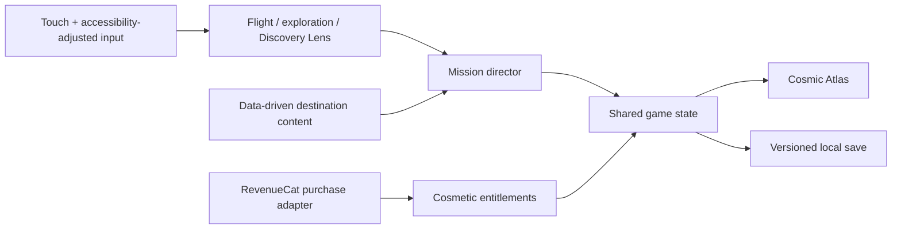

# Astronomy Adventure Game — Complete Design Blueprint

**Status:** Approved and design-locked; 2.5D architecture amended 2026-08-25  
**Approved:** 2026-08-21; 2.5D pivot approved 2026-08-25  
**Title:** *Just Some Stars*  
**Initial platform:** Android mobile  
**Later platform option:** Steam

## 1. One-sentence pitch

A group of kids begins a pretend space mission in their homemade clubhouse ship, accidentally launches into a real star system, and must explore scientifically grounded worlds, decode a cosmic Signal, and still make it home before dinner.

## 2. Product promise

This is a family-friendly, cinematic layered-2.5D astronomy adventure built
around wonder, play, discovery, speed and genuine learning. It should feel like
a premium game first and an educational experience because understanding the
universe is how the player succeeds.

The binding gameplay composition is
`outputs/just-some-stars-2.5d-gameplay-target-v1.png`. The earlier dimensional
Mirra concept remains palette, world and cast lineage, not a full-3D runtime
requirement.

The game is designed for whole-family appeal:

- Default science and reading depth targets approximately age 13+.
- Younger players use the same story and worlds with clearer language, stronger assistance, and earlier hints.
- Gameplay challenge and science depth are separate settings.
- No patronizing “baby mode” and no mandatory school-style quizzes.

## 3. Design pillars

### Awe with momentum

Every destination should contain at least one moment that makes the player stop and stare, followed by a reason to move, fly, or investigate.

### Science is the superpower

Real astronomy is not optional flavor. Players use observation, prediction, instrumentation, orbital motion, climate, and planetary science to advance.

### A child-sized emotional frame

The cosmic stakes sit inside a simple promise: the kids said they would return before dinner. That contrast keeps the story warm, funny, and memorable.

### One polished system, not an empty universe

Chapter One uses compact, handcrafted destinations and guided flight regions. It is not an open-world galaxy and does not rely on procedural repetition.

### Ethical family design

The game avoids advertisements, loot boxes, energy timers, paid power, artificial streak pressure, deceptive discounts, and learning paywalls.

## 4. Audience and adjustable experience

The default experience is **Balanced** with age-13+ explanations. Three independent groups of settings shape play:

| Setting | Guided | Balanced | Ace / Deep |
|---|---|---|---|
| Piloting | Strong steering correction, wide routes | Moderate assistance | Precise control, narrower margins |
| Exploration | Clear navigation and early hints | Contextual guidance | Minimal prompts and optional expert routes |
| Science depth | Short sentences and visual explanations | Default 13+ language | Extended terminology, data, and optional derivations |

All settings preserve the same story, discoveries, locations, and ending. Difficulty changes assistance rather than changing the fictional universe.

## 5. Story foundation

### Opening

Five neighborhood friends have constructed a “spaceship” in their clubhouse from telescope parts, discarded electronics, hand-painted panels, and an old training cockpit. Their homemade survey robot, Ori, is their proudest creation.

Before another pretend expedition, the kids tell their parents:

> “We’re going exploring! We’ll be back before dinner!”

Their parents agree, assuming it is ordinary playtime. When the crew activates its homemade antenna, the Signal answers. The ship awakens and carries them into the real Aurelia system. Whether the Signal transformed the clubhouse, transported it, or revealed what it always was remains deliberately unresolved in Chapter One.

### Central mystery

The Signal is a repeating pattern hidden inside real astronomical phenomena. Each destination provides evidence but supports competing interpretations: an unknown natural process, forgotten technology, or intelligence. Fiction connects the discoveries without replacing accurate science.

### Ending

After escaping the Aster Veil, the crew crash-lands inside the clubhouse at sunset. The kids race home and sit down just as dinner is served.

A parent asks, “So, did you discover anything?”

The crew exchanges looks and answers, “Just some stars.”

Under the table, Ori’s eye flickers. A Signal fragment in the captain’s pocket produces one final pulse. The credits begin, and the pulse points toward Chapter Two.

## 6. Player and crew

The crew comprises five kids and one robot. All names remain provisional.

- **Captain — the player:** customizable appearance, callsign, and pronouns. Mostly unvoiced so the player can inhabit the role. Makes final navigation and evidence decisions.
- **Mira — the Stargazer:** specializes in light, atmospheres, planets, and possible life. Curious and calm without becoming a lecturer.
- **Juno — the Builder:** repairs and modifies the ship using salvaged materials and clever inventions.
- **Kai — the Navigator:** loves speed, orbital maneuvers, and challenges that initially appear too risky.
- **Bea — the Chronicler:** photographs discoveries and constructs the Cosmic Atlas with the player. Acts as the emotional observer of the group.
- **Ori — the survey robot:** built collectively by the children. Expressive, playful, and physically accompanies surface expeditions. Ori has an unexplained connection to the Signal.

Usually two companions participate directly in a destination while the remainder contribute through ship communications. This creates a lively ensemble while limiting simultaneous character animation and dialogue complexity.

The emotional arc moves from friends playing assigned roles to a crew that genuinely trusts the player as captain. In the Aster Veil finale, the other children stop directing the player and place the mission in their hands.

## 7. Chapter One structure

Chapter One is a complete 45–60 minute main story composed of 5–12 minute sessions. Replayable flight challenges, hidden phenomena, photographs, and Atlas discoveries extend playtime.

All location and character names are working names.

### Act I — Mirra: Follow the sunset

Mirra is a tidally locked rocky planet with a hot permanent day side, frozen night side, and narrow twilight region.

The player:

1. Pilots through unstable winds toward the twilight band.
2. Lands and explores the border between fire and ice.
3. Restores a lost climate probe using observations of airflow and temperature.
4. Discovers the first Signal fragment inside the probe’s records.

Primary learning: rotation, tidal locking, atmospheric circulation, climate, and habitable zones.

### Act II — Koro and Vesper: Beneath the ice

Koro is an icy moon orbiting the ringed gas giant Vesper. Geysers reveal material from a warm subsurface ocean.

The player:

1. Uses Vesper’s gravity to reach Koro.
2. Traverses the surface in low gravity with Ori and two crew members.
3. Uses the Discovery Lens to compare geyser spectra.
4. Connects the geyser’s repeating rhythm to the Signal and recovers its second encoded fragment.

Primary learning: moons, tidal heating, subsurface oceans, spectroscopy, and ingredients associated with habitability.

### Act III — The Aster Veil: Race the orbit

The Aster Veil is the debris of a recently shattered moon, avoiding the unrealistic presentation of a permanently dense conventional asteroid belt.

The player:

1. Plots a route using momentum and gravity assists.
2. Flies through a shifting, high-speed debris region.
3. Recovers the third fragment from the shattered moon’s remains.
4. Reassembles all three fragments while protecting the crew.
5. Learns that the reconstructed pattern is a star map pointing beyond Aurelia.

The final pulse is recent, establishing that the mystery is active rather than purely ancient.

Primary learning: orbital paths, momentum, relative motion, gravity assists, and debris dynamics.

## 8. Core gameplay loop

1. Choose a destination or lead from the ship hub.
2. Fly a handcrafted 2.5D route with traversal, depth-lane and piloting challenges.
3. Enter orbit or land and explore a compact environment.
4. Observe a phenomenon and form or select a prediction.
5. Use the correct instrument or action to test it.
6. Record the discovery, Signal evidence, and photographs.
7. Return to the ship for crew scenes, upgrades, the Cosmic Atlas, and the next lead.

The target activity mix is approximately:

- 40% piloting and cosmic traversal
- 40% planetary exploration and investigation
- 20% ship, crew, Atlas, and customization

The game should not feel like a collection of unrelated minigames. Every interaction must belong to piloting, exploring, observing, testing, repairing, communicating, or documenting.

## 9. Mobile play feel

### Shared control language

- Left thumb: move or steer.
- Right thumb: contextual aiming, Lens focus and secondary action; gameplay has no free camera orbit.
- Primary contextual action: boost, scan, interact, grab, or test when its meaning is visually obvious.
- Secondary action: brake/drift during flight or jump/jet during exploration.

### Flight

Cinematic 2.5D ship flight provides bounded horizontal/vertical freedom and
authored visual depth lanes inside deliberately composed routes. It is neither
a passive rail sequence nor unrestricted travel through empty space.

### Surface exploration

Side-view character movement uses compact layered spaces, traversal, changing
gravity, environmental clues, crew banter and optional secrets.

### Discovery Lens

An optional in-world instrument overlay supports close observation. The player
aims instruments across declared scene depths, compares evidence, aligns data
and tests predictions inside the composed world. It never becomes a detached
quiz screen.

### Transitions

Approach, orbit, landing, and disembarking should feel continuous. Short cinematic masks may hide loading, but repeated loading menus should not interrupt the fantasy.

## 10. Learning design

Learning appears in three connected layers:

1. **Gameplay teaches:** the mechanic behaves according to the astronomical idea.
2. **Crew reinforces:** characters notice cause and effect in natural dialogue.
3. **Cosmic Atlas deepens:** curious players can inspect models, vocabulary, explanations, and evidence.

Required mission progress never depends on memorizing a paragraph. Knowledge is demonstrated by using it. Optional crew challenges can test understanding playfully without resembling school exams.

Scientific claims should be source-checked during content production. Fictional exceptions must be visually and narratively distinguished from real principles.

## 11. Progression and rewards

Progression follows three paths:

- **Journey:** discoveries reconstruct the Signal map and advance the story.
- **Mastery:** optional routes, hidden phenomena, expert objectives, and better mission performance.
- **Expression:** suits, ship finishes, trails, clubhouse decorations, photo frames, and Ori accessories.

The Cosmic Atlas is a living scrapbook. Each discovery can add:

- An interactive layered model or phenomenon
- The crew’s notes
- Real astronomy explanations at the selected depth
- Player photographs
- A visible link to the evidence surrounding the Signal

Gameplay upgrades such as scanner range, controlled boost behavior, or landing equipment are earned only through play. They create new possibilities rather than acting as numerical power inflation.

## 12. Monetization

The complete Chapter One is free. Monetization is limited to clearly priced cosmetic products managed through RevenueCat.

Rules:

- No advertisements
- No randomized loot
- No energy or waiting timers
- No paid gameplay advantages
- No learning paywalls
- No manipulative countdowns, fake discounts, or loss-framed streaks
- No premium virtual currency designed to obscure real prices
- Purchases require a parental gate
- Restore Purchases remains easy to find

Most cosmetics should be earnable through play. Paid sets are distinctive alternatives, never visually presented as superior status.

Recommended first offering: one transparent, non-consumable **Founding Crew Cosmetic Pack** containing a themed ship finish, matching suits, an Ori shell, and a clubhouse decoration. Exact contents and price remain an implementation-time decision.

## 13. Visual, audio, and interface direction

### Visual language

- Stylized cinematic layered 2.5D overall
- Painterly side-view worlds reconstructed from separately owned parallax,
  gameplay, atmosphere, foreground and lighting layers
- Coherent frame-atlas character animation with deliberately illustrated
  silhouettes rather than runtime skeletal deformation
- Scientifically grounded environments, lighting, scale cues, and phenomena
- Slight science-fantasy realism for grandeur
- Warm, rounded, storybook character and safe-space design
- Homemade kid-built surfaces layered with polished Signal holograms

Destination palettes:

- Mirra: sunset orange against deep frozen blue
- Koro and Vesper: icy cyan under immense violet skies
- Aster Veil: near-black space, brilliant debris, and Signal-purple accents

### Audio

Music blends orchestra, playful homemade instruments, and restrained electronics. The Signal motif is hidden inside each destination’s score and becomes recognizable during the finale.

Crew members receive expressive vocal reactions and a limited number of important voiced lines. Routine dialogue uses animated portraits, text, and captions to protect production scope.

### Interface

UI feels built by the children: taped labels, sketched constellations, scratched screens, physical toggles, and improvised panels combined with clean holographic information. Touch targets remain large and readable despite the decorative layer.

Photo Mode is a first-class feature with pause, bounded pan/zoom and approved
composition points, simple exposure controls, crew poses where possible and
cosmetic frames. It does not expose a free 3D orbit camera.

## 14. Accessibility

Required options:

- Independent gameplay assistance and science-depth controls
- Scalable text and a dyslexia-friendly font option
- Captions and adjustable dialogue speed
- Colorblind-safe symbols and contrast
- Reduced camera shake, flashing, motion blur, and particle density
- Left-handed layout and touch-sensitivity controls
- Guided navigation and optional crew hints
- Battery-saver presentation targeting stable 30 FPS
- Higher-quality mode targeting 60 FPS on capable devices

Accessibility settings must be available before the opening cinematic and changeable during play.

## 15. Technical foundation

### Recommended engine and project shape

- Unity 6 LTS
- Universal Render Pipeline with the 2D Renderer for gameplay scenes
- C#
- Unity Input System
- Addressables and data-driven content assets
- SpriteRenderer/SpriteAtlas frame animation with deterministic manifests and
  previews
- Codemagic for reproducible Android builds
- RevenueCat behind a purchase-service interface

Project areas:

- Boot and settings
- Clubhouse opening/ending
- Ship hub
- Shared flight systems
- Shared surface-exploration systems
- Discovery Lens
- Mission and dialogue director
- Cosmic Atlas and progression
- Save system
- Platform services
- Mirra, Koro/Vesper, and Aster Veil content packs

### State and data flow

Gameplay code must not call store, notification, analytics, or platform APIs directly. Those capabilities sit behind replaceable adapters so failures remain non-blocking and a future Steam build can substitute platform services without rewriting the game.

### Save strategy

- Offline-first; no account required
- Versioned local save schema
- Autosave only at safe checkpoints
- Last-known-good backup retained
- Atomic replacement to reduce corruption risk
- Settings stored separately from story progress where practical
- Save migration tests for every schema change

### RevenueCat and Galaxy Store integration risk

The official RevenueCat Unity package directly documents Google Play and Apple support. As of this blueprint date, RevenueCat’s Galaxy documentation lists Galaxy support for the native Android and React Native SDKs and says other hybrid SDK support is still coming. Therefore Galaxy monetization must remain behind a dedicated adapter rather than being assumed to work through the standard Unity package.

Recommended sequence:

1. Implement and demonstrate RevenueCat with the official Unity package on the Google Play Android path.
2. Keep the Galaxy build fully playable when the purchase adapter reports Store Unavailable.
3. Add Galaxy purchases only through either officially supported Unity integration available at build time or a separately tested native Android bridge.
4. Never delay or damage the free Chapter One experience to force the Galaxy payment integration.

Official references:

- [RevenueCat Unity installation](https://www.revenuecat.com/docs/getting-started/installation/unity)
- [RevenueCat Galaxy setup](https://www.revenuecat.com/docs/platform-resources/galaxy-platform-resources/galaxy-setup-guide)
- [RevenueCat Android Galaxy module](https://www.revenuecat.com/docs/getting-started/installation/android)

## 16. Performance strategy

Primary target: stable play on a representative mid-range Android device, with scalable quality for low- and high-end devices.

Use:

- Separately owned parallax layers with simple 2D collision
- Sprite normal/emission masks and a bounded number of 2D lights
- Deterministic character and environment atlases with platform-appropriate compression
- Pooled particles, fog cards and reusable effects
- Transparent-overdraw, texture-residency and atlas budgets per destination
- Scalable lighting, fog, particles, post-processing and render scale
- Additive or asynchronous destination loading
- Thermal and battery testing for full 12-minute sessions and complete Chapter One runs

Foldable support begins with safe resizing and UI continuity. Bespoke dual-pane gameplay is a later enhancement unless the core chapter is already polished.

## 17. Failure handling and privacy

### Expected failures

- **No network:** story and earned content continue; the shop reports that connection is required.
- **Store unavailable:** shop closes gracefully; gameplay never blocks.
- **Purchase interrupted:** no entitlement is guessed; status is checked again on resume.
- **Restore fails:** preserve current local cosmetics and offer a clear retry.
- **Save corruption:** load the last-known-good backup and explain the recovery simply.
- **Missing optional content:** return safely to the ship hub and log a diagnostic.
- **Low memory:** lower scalable effects and avoid loading the next destination until the current one unloads.

### Privacy posture

- No public chat, profiles, or user-generated public content
- No precise location
- No required account for Chapter One
- Minimal analytics, restricted to product quality and stability
- Parental gate before purchases or external links
- Parent-accessible privacy explanation in plain language

## 18. Verification plan

Required test stories:

- Complete Chapter One from a clean install in airplane mode
- Resume correctly from every checkpoint after force-closing the app
- Corrupt and migrate test saves without losing the backup
- Interrupt, cancel, fail, restore, and repeat purchases on physical devices
- Run Guided, Balanced, and Ace configurations through every mission
- Verify every science-depth setting and Atlas entry
- Test large text, left-handed layout, reduced motion, colorblind symbols, and captions together
- Run thermal, memory, battery, and frame-time checks on low-, mid-, and high-tier Android devices
- Verify phone and foldable aspect-ratio changes
- Confirm Google Play and Galaxy builds cannot accidentally call the wrong store adapter
- Conduct family playtests with a younger child, a teen, and an adult when safely available

## 19. Solo-developer scope boundary

Chapter One includes:

- One clubhouse opening and ending
- One reusable kid-built ship hub
- Three dense destinations
- Five kid crew members and Ori, with controlled companion combinations
- One complete Signal mystery arc with a sequel hook
- Flight, exploration, Discovery Lens, Atlas, accessibility, saving, and ethical cosmetics

Chapter One explicitly excludes:

- Multiplayer
- A procedurally generated universe
- Seamless interplanetary travel across empty distances
- Base building
- Public accounts or social feeds
- Live-service seasons
- Competitive leaderboards at initial release
- Multiple star systems
- Full voice acting for every line

New features enter only after the complete opening-to-dinner journey feels excellent.

## 20. Initial production order

This is sequencing guidance, not yet the detailed implementation plan:

1. Prove layered 2.5D movement, parallax, composition camera and performance in
   one 20–30 second Mirra test route.
2. Build the deterministic coherent-strip/frame-atlas pipeline and prove one
   painterly character round trip.
3. Produce the three Captain families, bespoke crew and Ori sprite sets.
4. Build a vertical slice containing a short 2.5D flight, landing mask, surface discovery, Atlas entry, and ship return.
5. Prove save recovery and accessibility early.
6. Integrate the Chapter One narrative wrapper and crew presentation.
7. Produce Mirra to final quality, then reuse proven systems for Koro and the Aster Veil.
8. Add RevenueCat only through the isolated purchase interface.
9. Complete device, store, offline, purchase and family playtesting.

## 21. Success criteria

The first release succeeds when:

- A family can finish a satisfying story in roughly one hour.
- A player can explain at least one real astronomical idea because they used it.
- The opening promise and dinner-table ending land emotionally.
- Flight, surface exploration, and science interactions feel like one coherent game.
- Chapter One works without an account or network connection.
- Optional purchases are transparent and never affect learning or power.
- The game maintains stable performance on its declared Android device range.
- The final pulse makes players genuinely want Chapter Two.

## 22. Intentionally open decisions

The approved design does not yet lock:

- Final game title
- Final names for the star, worlds, ship, and crew
- Exact cosmetic pack art and regional price
- Final voice cast or voice-production method
- Exact supported-device floor after prototype measurements
- Store-account, banking, and legal details, which the developer and parents will set up later

These choices should be resolved during planning or production without changing the locked product principles above.
